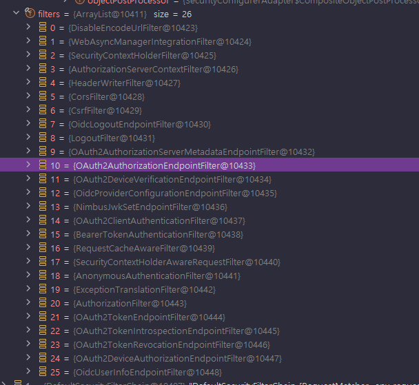

<nav>
    <a href="../.." target="_blank">[Spring Security OAuth2]</a>
</nav>

# 17.5 Spring Authorization Server - 인가서버 시작하기

---

## 1. 개요
- OAuth 2.0 Authorization Server 의 권한 부여 흐름에 대한 이해를 돕기 위해 간단한 어플리케이션을 만든다.
- 클라이언트는 Postman 을 사용하고 인가서버의 엔드포인트로 권한부여 요청 및 응답을 확인한다

---

## 2. AuthorizationServerConfig
```kotlin
@Configuration
class AuthorizationServerConfig {

    companion object {
        val log = getLogger(AuthorizationServerConfig::class.java)
    }

    /**
     * 인가서버 IssuerUri 등 여러가지 설정정보 관리
     */
    @Bean
    fun authorizationServerSettings(): AuthorizationServerSettings {
        return AuthorizationServerSettings.builder().issuer("http://localhost:9000").build()
    }

    /**
     * OAuth2 클라이언트 정보 저장 및 관리
     */
    @Bean
    fun registeredClientRepository(): RegisteredClientRepository {
        val registeredClient = RegisteredClient.withId(UUID.randomUUID().toString())
            .clientId("oauth2-client-app")
            .clientSecret("{noop}secret")
            .clientAuthenticationMethod(ClientAuthenticationMethod.CLIENT_SECRET_BASIC)
            .clientAuthenticationMethod(ClientAuthenticationMethod.CLIENT_SECRET_POST)
            .authorizationGrantType(AuthorizationGrantType.AUTHORIZATION_CODE)
            .authorizationGrantType(AuthorizationGrantType.REFRESH_TOKEN)
            .authorizationGrantType(AuthorizationGrantType.CLIENT_CREDENTIALS)
            .redirectUri("http://127.0.0.1:8081")
            .scope(OidcScopes.OPENID)
            .scope("read")
            .scope("write")
            .clientSettings(ClientSettings.builder().requireAuthorizationConsent(true).build())
            .build()

        return InMemoryRegisteredClientRepository(registeredClient)
    }

    @Bean
    fun jwtDecoder(jwkSource: JWKSource<SecurityContext>): JwtDecoder {
        return OAuth2AuthorizationServerConfiguration.jwtDecoder(jwkSource)
    }

    @Bean
    fun jwkSource(): JWKSource<SecurityContext> {
        val rsaKey = getRsaKey()
        val jwkSet = JWKSet(rsaKey)
        return ImmutableJWKSet(jwkSet)
    }

    private fun getRsaKey(): RSAKey {
        val keyPair = generateRsaKeyPair()
        return RSAKey
            .Builder(keyPair.public as RSAPublicKey)
            .privateKey(keyPair.private as RSAPrivateKey)
            .keyID(UUID.randomUUID().toString())
            .build()
    }

    private fun generateRsaKeyPair(): KeyPair {
        val keyPair: KeyPair
        try {
            val keyPairGenerator = KeyPairGenerator.getInstance("RSA")
            keyPairGenerator.initialize(2048)
            keyPair = keyPairGenerator.generateKeyPair()
        } catch(e: Exception) {
            log.error(e) { "인가서버 jwk 설정 실패 - RSA 키 생성 과정에서 오류가 발생했습니다." }
            throw IllegalStateException(e)
        }
        return keyPair
    }

}
```
- 인가서버 구성에 필요한 설정들을 모아둔다.
- OAuth 2.0 Authorization Server 지원을 위한 설정 클래스
  - RegisteredClientRepository : 인가서버에 등록된 클라이언트 저장소
  - AuthorizationServerSettings : 인가서버(issuer) Uri 설정
  - JwtDecoder : UserInfo 엔드포인트에 접근하기 위해서는 사용자 인증이 필요한데, 이를 위한 JwtDecoder 설정
  - JWKSource : JWT 발행시 필요한 RSA 키 쌍에 관한 정보
- 클라이언트 요청은 OAuth 2.0 Authorization Code Grant 타입으로 한다
  - OpenID Connect 가 실행되도록 scope 에 openid 가 포함되도록 한다
  - 클라이언트 인증 방법은 Basic 으로 한다
  - 클라이언트 RedirectUri 는 http://127.0.0.1:8081 로 한다
  - 클라이언트 코드 발급 요청 시 승인을 필요로 하도록 한다.

---

## 3. SecurityUserManagementConfig
```java
@Configuration
class SecurityUserManagementConfig {

    @Bean
    fun userDetailsService(): UserDetailsService {
        val user = User.builder()
            .username("user")
            .password("{noop}1111")
            .roles("USER")
            .build()
        return InMemoryUserDetailsManager(user)
    }
}
```
- 인가서버가 클라이언트에게 권한 부여를 하기 위해서는 리소스 소유자(최종 사용자)의 인증이 필요하기 때문에 사용자 인증 메커니즘을 구성해야 한다.
- 이 과정에서 필요한 최종사용자 정보를 메모리에 보관하여 관리한다.
  - 기본 사용자를 임의로 생성해둔다.

---

## 4. SecurityFilterChainsConfig
```kotlin
@Configuration
class SecurityFilterChainsConfig {

    /**
     * 인가서버 관련 기능
     *
     */
    @Order(0)
    @Bean
    fun authorizationServerSecurityFilterChain(http: HttpSecurity): SecurityFilterChain {
        val authorizationServerConfigurer = OAuth2AuthorizationServerConfigurer()
        authorizationServerConfigurer.oidc(Customizer.withDefaults())

        val endpointsMatcher = authorizationServerConfigurer.endpointsMatcher

        http {
            securityMatcher(endpointsMatcher)
            authorizeHttpRequests {
                authorize(anyRequest, authenticated)
            }
            csrf {
                ignoringRequestMatchers(endpointsMatcher)
            }
            with(authorizationServerConfigurer)
            exceptionHandling {
                authenticationEntryPoint = LoginUrlAuthenticationEntryPoint("/login")
            }
            oauth2ResourceServer {
                jwt { }
            }
        }
        return http.build()
    }

    /**
     * 사용자 로그인("/login") -> Form 로그인 처리
     * 그 외 모든 요청 -> 인증 필요
     */
    @Order(1)
    @Bean
    fun userAuthenticationSecurityFilterChain(http: HttpSecurity): SecurityFilterChain {
        http {
            authorizeHttpRequests {
                authorize(anyRequest, authenticated)
            }
            formLogin { }
        }
        return http.build()
    }
}
```
- 필터체인 두 개를 등록한다.
  - 인가서버 관련 설정: 인가, 토큰 발급, 토큰 검증, 사용자 정보, ...
    - OAuth2AuthorizationServerConfigurer 는 oidc 를 기본설정하지 않기 때문에 우리가 수동으로 oidc 설정을 해야한다.
  - 기본 필터체인: 최종사용자 폼 인증, 그 외 기타
- 순서 상, 인가서버 관련 API 필터체인쪽은 우선도를 높게 잡아서 먼저 조건에 맞으면 요청을 가로채도록 했다.
- 폼 로그인 API 에 대해서는 인증을 필요하도록 설정했다.

---

## 5. 실행

### 5.1 코드 발급
- GET `http://localhost:9000/oauth2/authorize?response_type=code&client_id=oauth2-client-app&scope=openid read write&redirect_uri=http://127.0.0.1:8081`
  - Uri: `http://localhost:9000/oauth2/authorize`
  - 헤더
    - `response_type=code`
    - `client_id=oauth2-client-app`
    - `scope=openid read write`
    - `redirect_uri=http://127.0.0.1:8081`
- 승인 화면을 통해 동의를 하고, 리다이렉트 되면 코드가 같이 발급된다.

### 5.2 토큰 발급
- POST `http://localhost:9000/oauth2/token`
- 헤더
  - Authorization: Basic xxxxx
    - `client-id:client-secret` 을 Base64 인코딩한 문자열을 넣어줘야한다.
    - POSTMAN 에서 쉽게 할 수 있도록 지원해준다.
  - Body: x-www-form-urlencoded
    - grant-type: authorization_code
    - redirect_uri: `http://127.0.0.1:8081`
    - code: 위에서 받은 코드
- 잘 실행하면 access_token, id_token 등이 발급된다.

### 5.3 사용자 정보 획득
- GET `http://localhost:9000/userinfo`
- 헤더
  - Authorization: Bearer 액세스토큰
- 잘 실행하면 간단한 사용자 정보를 획득할 수 있다.

---

## 6. 간략하게 보는 동작 원리

### 6.1 코드 발급


- GET `/oauth2/authorize` 은 코드 발급을 위한 엔드포인트이므로, 0번째 필터체인이 가로챈다.
- OAuth2AuthorizationEndPointFilter 에서 코드 발급 처리를 가로챈다
  - 최종사용자는 미인증 상태인데 이 경우 chain.doFilter 를 통해 통과된다.
  - 이후 AuthorizationFilter에서 인증에 실패하고 "/login" 으로 페이지로 리다이렉트된다.
- `/login` 은 폼 로그인을 위한 엔드포인트이고, 1번째 필터체인이 가로챈다.
  - 사용자는 인증을 수행하고 `/oauth2/authorize` 로 돌아온다. (요청이 기본적으로 캐싱되기 때문에 인증 성공 후속처리로 이곳으로 리다이렉트됨)
- OAuth2AuthorizationEndPointFilter 는 인증처리를 AuthenticationManager 에게 위임하고 이 처리를
- OAuth2AuthorizationCodeRequestAuthenticationProvider 가 수행한다.
  - OAuth2AuthorizationCodeRequestAuthenticationProvider는 사용자의 승인이 필요하다면 OAuth2AuthorizationConsentAuthenticationToken 을 발급한다.
- OAuth2AuthorizationConsentAuthenticationToken 이 return 되면, OAuth2AuthorizationEndPointFilter 는 사용자를 승인 페이지로 리다이렉트 시켜서 다시 승인을 시도하게 한다.
- 사용자의 승인을 거치고 나면 `/oauth2/authorize` 로 POST 요청이 전달된다. 이 인증 요청은 OAuth2AuthorizationConsentAuthenticationProvider 가
처리한다.
- 성공적으로 승인처리가 완료되면 코드와 몇 가지 파라미터를 함께 url 에 담아 리다이렉트 시킨다.

### 6.2 토큰 발급
- 요청 시 Authorization 헤더에 Basic 인증을 위한 값을 설정했다.
- POST `/oauth2/token` 은 토큰 발급을 위한 엔드포인트이며 OAuth2TokenEndpointFilter 에서 처리한다.
- 그런데 이 필터는 AuthorizationFilter 뒤에 있다. 클라이언트의 인증을 거쳐야한다.
- 클라이언트 인증은 OAuth2ClientAuthenticationFilter 에서 처리한다.
  - ClientSecretAuthenticationProvider 에서 이 처리를 담당하고, 클라이언트의 인증을 수행한다.
- 클라이언트 인증에 성공하고, AuthorizationFilter 를 통과한다.
- OAuth2TokenEndpointFilter 가 요청을 가로채고, 토큰을 발급한다.

### 6.3 사용자 정보 획득
- GET `/userinfo` 는 사용자 인증을 위한 엔드포인트이다.
- 이 엔드포인트는 최종 사용자 인증이 필요하다.
  - 액세스토큰을 함께 전달해야한다.
- 액세스토큰의 인증은 BearerTokenAuthenticationFilter 가 담당한다. 여기서 인증을 수행하지 않으면 `/userinfo` 에 접근할 수 없다.
  - 이를 위해 우리는 resourceServer API 를 설정하였다.
- 인증에 성공하면 OidcUserInfoEndpointFilter 에서 요청을 가로채 처리한다.
- 정상적으로 사용자 정보를 받을 수 있다.

---
