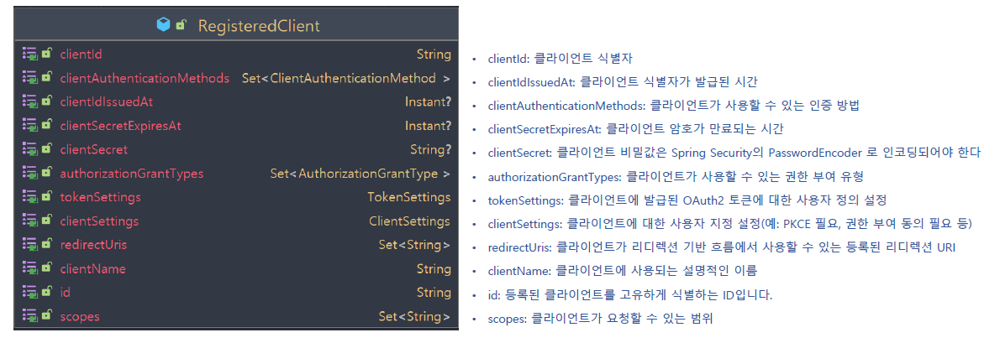
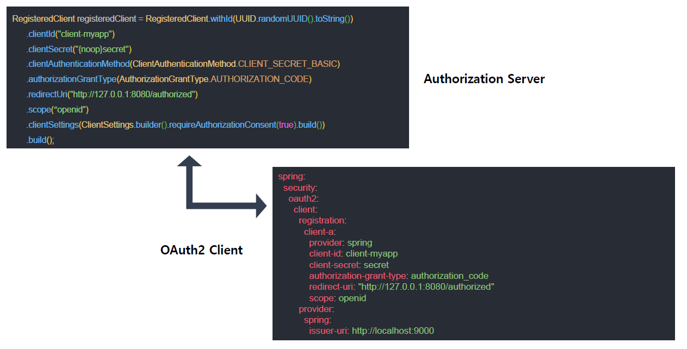
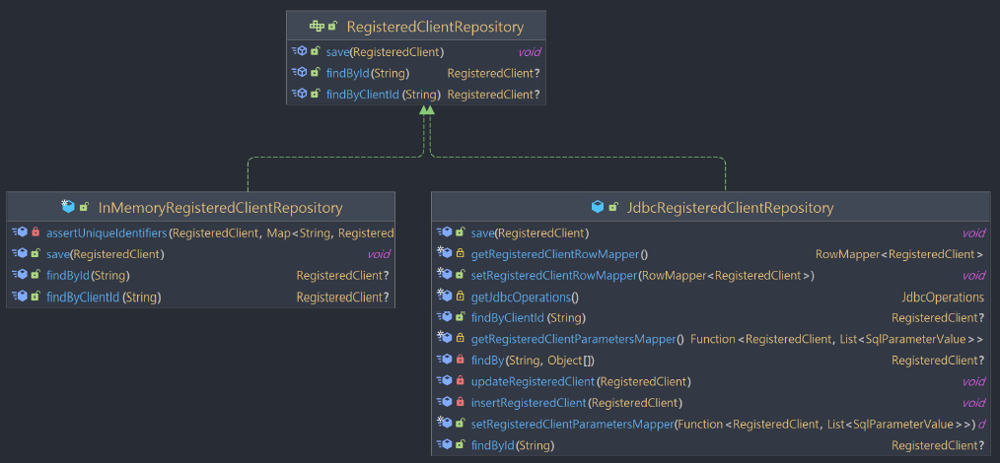

<nav>
    <a href="../.." target="_blank">[Spring Security OAuth2]</a>
</nav>

# 18.1 RegisteredClientRepository & RegisteredClient 이해 및 활용

---

## 1. RegisteredClient


### 1.1 RegisteredClient 란?
- 인가서버에 등록된 클라이언트를 의미한다.
- 클라이언트가 `authorization_code` 또는 `client_credentials` 와 같은 권한 부여 흐름을 시작하려면 먼저 클라이언트를 권한 부여 서버에 등록해야 한다.
- 클라이언트 등록 시 `client_id`, `client_secret` 및 고유한 클라이언트 식별자와 연결된 메타데이터를 이 객체에 할당한다.
  - 클라이언트의 메타데이터는 클라이언트 이름부터 프로토콜 흐름과 관련된 항목(예: 유효한 리다이렉션 URI 목록)까지 다양하다.
- Spring Security의 OAuth2 Client 지원에서 해당 클라이언트 등록 모델은 `ClientRegistration` 이다
- 클라이언트의 주요 목적은 보호된 리소스에 대한 액세스를 요청하는 것인데, 클라이언트는 먼저 권한 부여 서버에 인증하여 액세스 토큰을 획득해야한다.
  - 권한 부여 서버는 클라이언트 및 권한 부여를 인증하고 유효한 경우 액세스 토큰을 발급해야한다.
  - 클라이언트는 액세스 토큰을 이후 리소스 서버에 제출하여 보호된 리소스를 요청할 수 있다.

### 1.2 주요 설정값
- `id`: 등록된 클라이언트를 고유하게 식별하는 ID
- `clientId`: 클라이언트 식별자
- `clientSecret`: 클라이언트 비밀값은 Spring Security의 PasswordEncoder 로 인코딩되어야 한다
- `clientName`: 클라이언트에 사용되는 설명적인 이름
- `clientIdIssuedAt`: 클라이언트 식별자가 발급된 시간
- `clientAuthenticationMethods`: 클라이언트가 사용할 수 있는 인증 방법
  - 예) basic, post, jwt, ...
- `clientSecretExpiresAt`: 클라이언트 암호가 만료되는 시간
- `authorizationGrantTypes`: 클라이언트가 사용할 수 있는 권한 부여 유형
  - 예) authorize_code, client_credentials, ...
- `tokenSettings`: 클라이언트에 발급된 OAuth2 토큰에 대한 사용자 정의 설정
- `clientSettings`: 클라이언트에 대한 사용자 지정 설정(예: PKCE 필요, 권한 부여 동의 필요 등)
- `redirectUris`: 클라이언트가 리디렉션 기반 흐름에서 사용할 수 있는 등록된 리디렉션 URI
- `scopes`: 클라이언트가 요청할 수 있는 범위

### 1.3 RegisteredClient 구성방법


- RegisterClient 클래스의 Builder 메서드를 호출하여 클라이언트 객체를 생성할 수 있다.
- 참고로 여기서 설정한 값은 OAuth2 Client 애플리케이션에서 잘 매칭시켜서 설정해야한다.
- Oauth2 Authorization Server 는 사용자의 요청 정보와 등록된 RegisterClient 를 매칭시켜서 클라이언트 식별 및 유효성 검증에 사용한다.

---

## 2. RegisteredClientRepository


- 새로운 클라이언트를 등록하고 기존 클라이언트를 조회할 수 있는 저장소 클래스
- 클라이언트 인증, 권한 부여 처리, 토큰 자체 검사, 동적 클라이언트 등록 등과 같은 특정 프로토콜 흐름 시 다른 구성 요소에서 참조한다.
- 제공하는 구현체로 InMemoryRegisteredClientRepository 및 JdbcRegisteredClientRepository 가 있다

---

## 3. 실습

### 3.1 설정
```kotlin
    /**
     * OAuth2 클라이언트 정보 저장 및 관리
     */
    @Bean
    fun registeredClientRepository(): RegisteredClientRepository {
        val registeredClient1 = createRegisteredClient("oauth2-client-app1", "{noop}secret1", "read", "write")
        val registeredClient2 = createRegisteredClient("oauth2-client-app2", "{noop}secret2", "read", "delete")
        val registeredClient3 = createRegisteredClient("oauth2-client-app3", "{noop}secret3", "read", "update")

        return InMemoryRegisteredClientRepository(registeredClient1, registeredClient2, registeredClient3)
    }

    private fun createRegisteredClient(
        clientId: String,
        clientSecret: String,
        vararg scopes: String
    ): RegisteredClient {
        val builder = RegisteredClient.withId(UUID.randomUUID().toString())
            .clientId(clientId)
            .clientSecret(clientSecret)
            .clientName(clientId)
            .clientIdIssuedAt(Instant.now())
            .clientSecretExpiresAt(Instant.MAX)
            .clientAuthenticationMethod(ClientAuthenticationMethod.CLIENT_SECRET_BASIC)
            .clientAuthenticationMethod(ClientAuthenticationMethod.CLIENT_SECRET_POST)
            .authorizationGrantType(AuthorizationGrantType.AUTHORIZATION_CODE)
            .authorizationGrantType(AuthorizationGrantType.CLIENT_CREDENTIALS)
            .authorizationGrantType(AuthorizationGrantType.REFRESH_TOKEN)
            .redirectUri("http://127.0.0.1:8081")
            .scope(OidcScopes.OPENID)
            .scope(OidcScopes.PROFILE)
            .scope(OidcScopes.EMAIL)
            .clientSettings(ClientSettings.builder().requireAuthorizationConsent(true).build())

        if (scopes.isNotEmpty()) {
            scopes.forEach { builder.scope(it) }
        }
        return builder.build()
    }
```
- 클라이언트 3개를 등록하여 InMemoryRegisteredClientRepository 에 등록했다.
- 각 클라이언트 별로 clientId, clientSecret, scope가 제각각 다른데 만약 요청 시 일치하지 않는 내용이 포함될 경우 요청을 거부할 수 있다.

### 3.2 컨트롤러
```kotlin
@RestController
class RegisteredClientController(
    private val registeredClientRepository: RegisteredClientRepository
) {

    @GetMapping("/registeredClients")
    fun list(): List<RegisteredClient> {
        val client1 = registeredClientRepository.findByClientId("oauth2-client-app1")!!
        val client2 = registeredClientRepository.findByClientId("oauth2-client-app2")!!
        val client3 = registeredClientRepository.findByClientId("oauth2-client-app3")!!

        return listOf(client1, client2, client3)
    }
}
```
- 등록한 RegisteredClientRepository 를 통해 RegisteredClient 들을 하나씩 조회해서 리스트로 뿌려준다.

---
