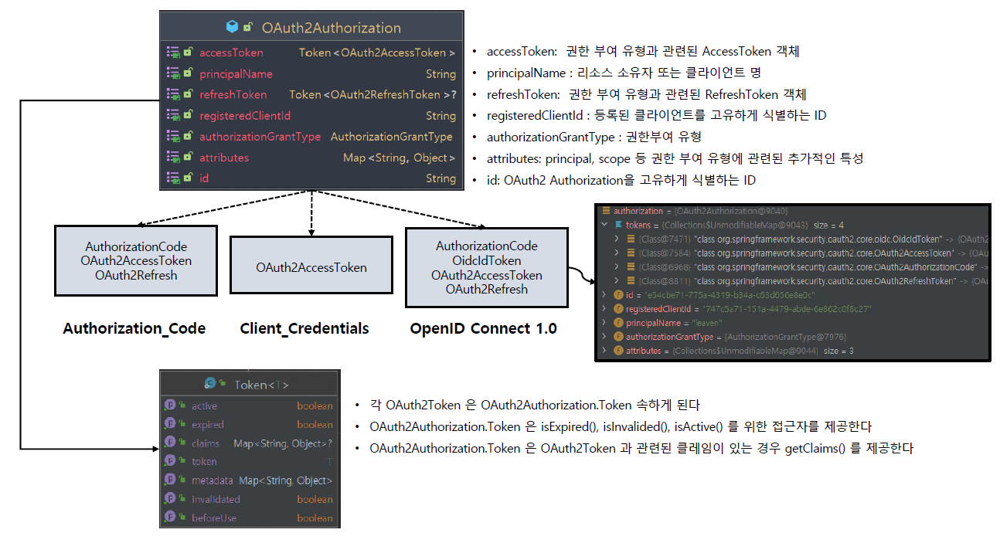
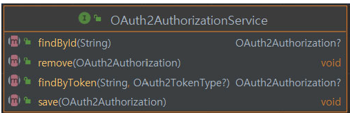
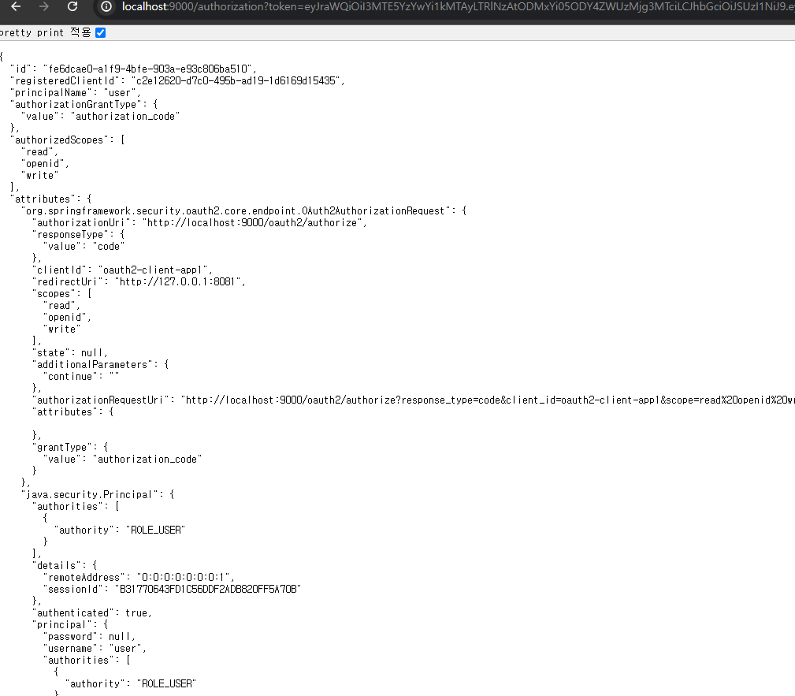

<nav>
    <a href="../.." target="_blank">[Spring Security OAuth2]</a>
</nav>

# 18.2 OAuth2AuthorizationService & OAuth2Authorization 이해 및 활용

---

## 1. OAuth2Authorization
- 리소스 소유자의 역할이 있는 권한 부여 방식인 경우 클라이언트에 부여된 권한 부여 즉 인가 상태를 유지하는 클래스
- Spring Security의 OAuth2 Client 의 해당 인증 모델은 OAuth2AuthorizedClient 와 서로 대응하는 개념이다.
- 권한 부여 흐름이 성공적으로 완료되면 OAuth2Authorization이 생성되고 AccessToken 이 저장되며 선택적으로 RefreshToken, IDToken 등이 저장된다.
- 생성된 OAuth2Authorization 은 OAuth2AuthorizationService 에 의해 메모리나 DB 에 저장된다
- OAuth2Authorization 에 저장되는 OAuth2Token 타입들은 권한 부여 유형 및 Scope 에 따라 다르다




```java
public class OAuth2Authorization implements Serializable {
	private static final long serialVersionUID = SpringAuthorizationServerVersion.SERIAL_VERSION_UID;
	private String id;
	private String registeredClientId;
	private String principalName;
	private AuthorizationGrantType authorizationGrantType;
	private Set<String> authorizedScopes;
	private Map<Class<? extends OAuth2Token>, Token<?>> tokens;
	private Map<String, Object> attributes;
```
- tokens 쪽에는 액세스토큰, code, 리프레시 토큰, id_token 등의 토큰 정보가 저장된다.
- attributes 쪽에는 부가적인 인증에 관련된 정보들이 저장된다.
  - state, pkce 관련 정보, ...

---

## 2. OAuth2AuthorizationService


- OAuth2AuthorizationService 는 새로운 OAuth2Authorization 을 저장하고 기존 OAuth2Authorization 을 검색하는 구성요소이다
- 특정 엔드포인트 프로토콜 흐름을 따를 때 다른 구성 요소에서 사용된다
  - 예) 클라이언트 인증, 권한 부여 처리, 토큰 자체 검사, 토큰 취소, 동적 클라이언트 등록 등
- 제공되는 기본 구현체는 InMemoryOAuth2AuthorizationService 및 JdbcOAuth2AuthorizationService 이 있다.
  - InMemoryOAuth2AuthorizationService 는 메모리에 클라이언트 정보를 저장하는데, 개발 및 테스트에만 사용하는 것이 좋으며 기본값이다.
  - JdbcOAuth2AuthorizationService 는 JdbcTemplate 를 사용하여 OAuth2Authorization 객체를 DB 에 저장하여 상태를 계속 유지하도록 한다
- 우리가 스프링 빈을 등록해두면 해당 빈이 우선적으로 사용된다.(OAuth2AuthorizationEndpointConfigurer) 혹은 sharedObject 설정을 통해 제공하여 설정해도 된다.

---

## 3. 실습

### 3.1 빈 등록
```kotlin
    @Bean
    fun oauth2AuthorizationService(): OAuth2AuthorizationService {
        return InMemoryOAuth2AuthorizationService()
    }
```
- 메모리에 OAuth2Authorization 을 저장하는 InMemoryOAuth2AuthorizationService 을 빈으로 등록한다.
- 이 빈 등록 정보는 OAuth2AuthorizationEndpointConfigurer 에서 참조되어 설정에 사용된다.

### 3.2 컨트롤러
```kotlin
@RestController
class OAuth2AuthorizationController(
    private val oauth2AuthorizationService: OAuth2AuthorizationService
) {

    @GetMapping("/authorization")
    fun oauth2Authorization(token: String): OAuth2Authorization {
        return oauth2AuthorizationService.findByToken(token, OAuth2TokenType.ACCESS_TOKEN)!!
    }
}

```
- findByToken 을 통해 토큰 전달 시 OAuth2AuthorizationService 를 통해 OAuth2Authorization 를 찾아 반환

### 3.3 실습 결과


- OAuth2Authorization 객체가 반환되고, 이 안에는 최초 코드 발급 시 생성된 정보 및 토큰 발급 후의 상태들이 잘 저장되어 있다.

---
