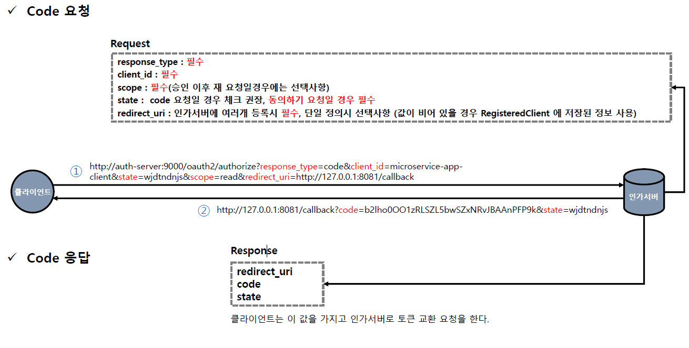
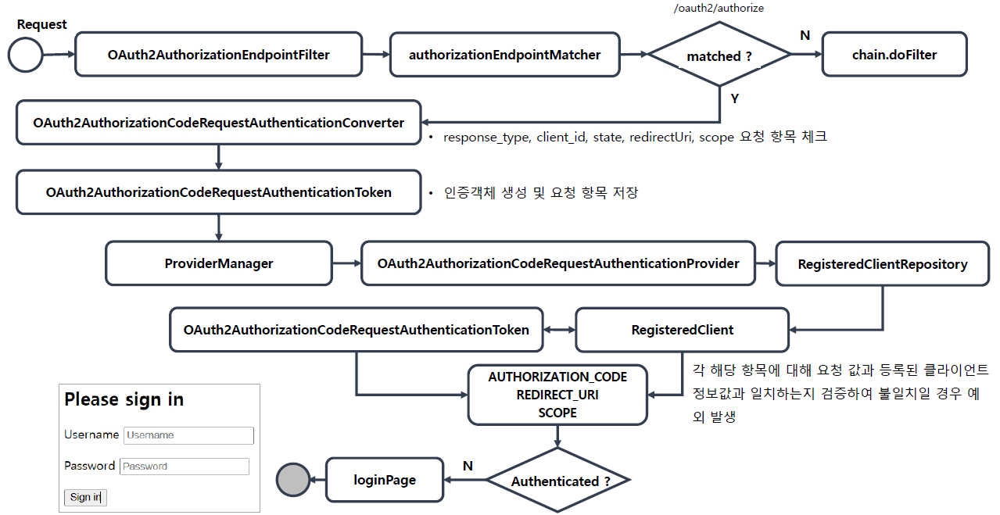
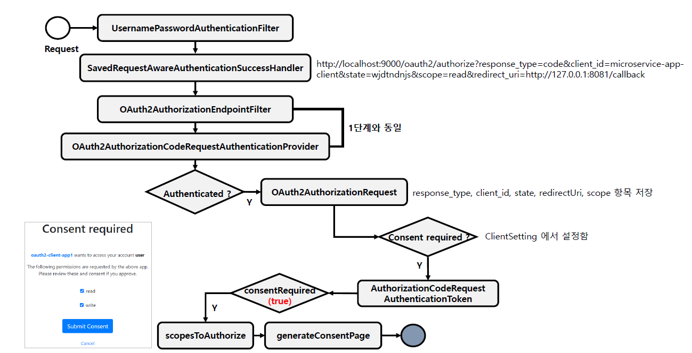
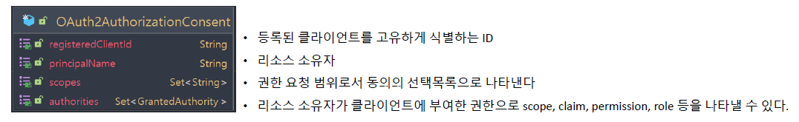
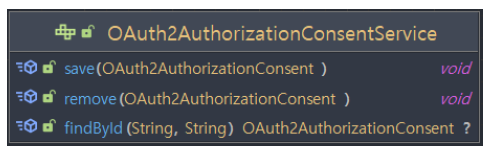
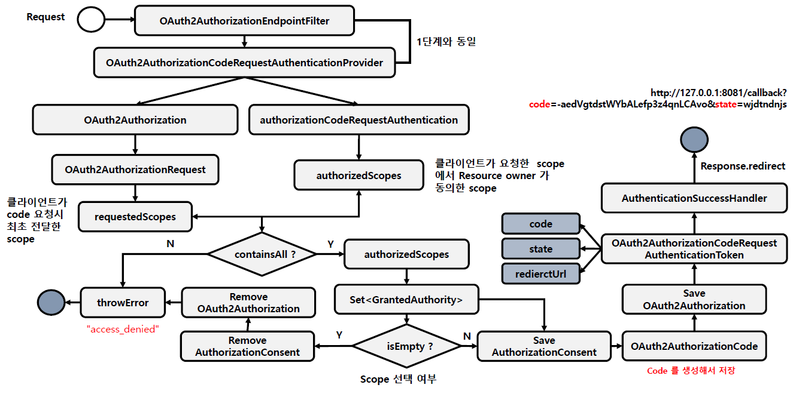

<nav>
    <a href="../.." target="_blank">[Spring Security OAuth2]</a>
</nav>

# 19.1 authorizationEndpoint() - 권한부여 요청 및 동의

---

## 1. OAuth2AuthorizationEndpointConfigurer
- OAuth2 권한부여 요청/동의 엔드포인트에 대한 사용자 정의 할 수 있는 기능을 제공한다.
- OAuth2AuthorizationEndpointFilter 를 구성하고 이를 OAuth2 인증 서버 SecurityFilterChain 빈에 등록한다

---

## 2. OAuth2AuthorizationEndpointFilter
- OAuth2 권한부여 요청(및 동의)을 처리하는 필터이며 다음과 같은 기본값으로 구성된다
- OAuth2AuthorizationCodeRequestAuthenticationConverter
  - 클라이언트 요청 파라미터를 `OAuth2AuthorizationCodeRequestAuthenticationToken` 으로 변환하고 AuthenticationProvider 에게
  전달한다
- OAuth2AuthorizationCodeRequestAuthenticationProvider
  - Authorization Code 권한 부여 방식을 처리하는 OAuth 2.0 인증 요청 및 동의에 대한 AuthenticationProvider 구현체이다.

### RequestMatcher
- Code 요청 패턴
  - `/oauth2/authorize`, GET
  - `/oauth2/authorize`, POST
- Consent (동의하기) 요청 패턴
  - `/oauth2/authorize`, POST

---

## 3. code 발급 과정

### 3.1 개요

- code 요청
  - 필수 파라미터
    - response_type : 필수
    - client_id : 필수
    - scope: 필수(승인 이후 재요청일 경우 선택사항)
  - 선택 파라미터
    - state: code 요청일 경우 체크 권장(동의하기 요청인 경우 필수)
    - redirect_uri : 인가서버에 여러개 등록되어있을 경우 필수(값이 비어있으면 RegisteredClient 에 저장된 정보 사용)
- code 응답
  - redirect_uri 에 code, state 를 덧붙여서 반환
  - 클라이언트는 여기서 받은 code, state 를 받아서 토큰 발급에 사용할 수 있다.

### 3.2 Resource Owner 의 인증 전 단계

- 우선 최종 사용자의 인증이 필요하다.
- OAuth2AuthorizationEndpointFilter 의 RequestMatcher 가 요청이 맞는 지 확인하고 맞으면 요청을 가로챈다.
- OAuth2AuthorizationCodeRequestAuthenticationConverter 에서 클라이언트 요청을 분석하고 OAuth2AuthorizationCodeRequestAuthenticationToken 을 구성한다.
  - 이 과정에서 response_type, client_id, state, redirect_uri, scope 파라미터 구문이 유효한지 검증이 일어난다.
  - 올바른 형식의 문자열로 왔는 지, 필수 파라미터 값이 잘 왔는 지, ...
- ProviderManager 에게 OAuth2AuthorizationCodeRequestAuthenticationToken을 전달하여 인증 처리를 위임한다.
- OAuth2AuthorizationCodeRequestAuthenticationProvider 가 요청을 가로채 처리한다.
  - RegisteredClientRepository 를 통해 등록된 클라이언트 정보(RegisteredClient) 를 꺼낸다.
  - 클라이언트의 등록 정보(client_id, redirect_uri, scope) 가 요청과 잘 맞는 지 검증한다.
  - 요청 사용자가 인증되지 않았다면 토큰을 그대로 다시 반환한다.
- 토큰이 제대로 반환되지 않았으므로 doFilter 를 호출하여 다음 필터로 넘기게 되고 loginUrl 로 리다이렉트 된다.
  - 이 과정에서 사용자의 현재 요청 정보는 캐싱된다.

### 3.3 Resource Owner 의 동의

- 사용자는 loginUrl로 리다이렉트 한뒤 폼을 통해 로그인 하고, 다시 이전의 캐싱된 요청으로 리다이렉트한다.
- OAuth2AuthorizationEndpointFilter 가 요청을 가로채고, 이 흐름은 OAuth2AuthorizationCodeRequestAuthenticationProvider 까지 똑같이 이어진다.
- OAuth2AuthorizationCodeRequestAuthenticationProvider 에서 요청을 처리한다.
  - 인증된 사용자이므로 위에서의 인증 확인 절차는 통과된다.
- authorizationConsentService 를 통해 사용자의 동의 정보(OAuth2AuthorizationConsent) 를 조회한다.
- requireAuthorizationConsent 체크
  - ClientSetting 에 동의 설정이 체크되어 있지 않으면 동의가 필요하지 않다.
  - 요청에 openid 스코프만 포함되어 있으면 동의가 필요하지 않다.
  - 이미 동의한 consent가 있고, consent 에 요청의 모든 scope가 포함되어 있을 경우 동의가 더 이상 필요하지 않다.
  - 동의가 필요 없으면 OAuth2AuthorizationCodeRequestAuthenticationToken (code 발급 절차) 발급
    - 보통 서비스는 클라이언트의 동의가 필요하므로 이 절차는 설명을 생략하겠다.
- 동의가 필요하다면
  - OAuth2AuthorizationService 에 클라이언트 정보 저장
  - OAuth2AuthorizationConsentAuthenticationToken 을 반환(인증된 상태)
- OAuth2AuthorizationEndpointFilter 에서는 OAuth2AuthorizationConsentAuthenticationToken 을 받았을 경우
동의 요청이 필요하다고 간주하고 sendAuthorizationConsent (동의화면 응답 절차)를 시작한다.
  - consentUri 가 설정되어 있으면 해당 페이지로 동의에 필요한 필수 파라미터를 덧붙여서 리다이렉트한다.
    - scope, client_id, state
  - consentUri 가 설정되어 있지 않으면 기본 동의화면 HTML 을 렌더링하여 응답한다.

#### 3.3.1 OAuth2AuthorizationConsent

- OAuth2AuthorizationConsent 는 OAuth2 권한 부여 요청 흐름의 권한부여 "동의“ (결정)를 나타낸다.
- 클라이언트에 대한 액세스를 승인할 때 리소스 소유자는 클라이언트가 요청한 권한의 하위 집합만 허용할 수 있습니다.
- 클라이언트가 범위를 요청하고 리소스 소유자가 요청된 범위에 대한 액세스를 허용하거나 거부하는 authorization_code grant 흐름이다
- OAuth2 인증 요청 흐름이 완료되면 OAuth2 Authorization Consent가 생성(또는 업데이트)되고 부여된 권한을 클라이언트 및 리소스 소유자와 연결한다.

#### 3.3.2 OAuth2AuthorizationConsentService

- OAuth2AuthorizationConsent 저장되고 기존 OAuth2AuthorizationConsent 를 조회하는 클래스로 주로 OAuth2 권한 부여 요청 흐름을 구현하는 구성 요소에 의해 사용된다
- 기본 구현체는 InMemoryOAuth2AuthorizationConsentService 와 JdbcOAuth2AuthorizationConsentService 가 있다

### 3.4 code 발급

(그림에서 OAuth2AuthorizationCodeRequestAuthenticationProvider가 작동하는데 지금은 구현이 다르다. 아래 내용을 참고)
- 사용자는 동의화면을 받고 동의 절차를 수행한다.
- 동의 요청 엔드포인트: `/oauth2/authorize`, POST
- OAuth2AuthorizationConsentAuthenticationConverter 가 작동하여 OAuth2AuthorizationConsentAuthenticationToken 을 구성한다.
  - 필수적인 파라미터의 존재유무 확인(client_id, state)
  - scopes가 함께 전달되면 additionalParameters 에 scope 들 하나씩 담기
  - OAuth2AuthorizationConsentAuthenticationToken 구성
- OAuth2AuthorizationConsentAuthenticationProvider 작동
- OAuth2AuthorizationService 에서 token 조회 : authorization
- 검증
  - OAuth2AuthorizationService -> OAuth2Authorization -> authorizationRequest -> requestedScopes: (클라이언트가 code 최초 요청 시 scope)
  - authorizationConsentAuthentication -> authorizedScopes : 현재 code 발급 요청 정보에 담긴 scopes (최종사용자가 승인한 scope)
  - requestedScopes에 authorizedScopes 는 모두 포함되어야한다. 그렇지 않을 경우 예외 발생
  - 이 authorizedScopes 를 기반으로 `Set<GrantedAuthority>` 를 구성한다.
    - 이 set이 비어있으면 예외 발생하고 oauth2Authorization 을 지우고 예외 발생
    - 이 set이 비어있지 않으면 AuthorizationConsent를 생성하고 OAuth2AuthorizationConsentService 에 저장
  - OAuth2Authorization 재구성 및 저장
    - state 말소
    - OAuth2AuthorizationCode 를 생성하여 저장
    - authorizationService 에 다시 저장
- OAuth2AuthorizationCodeRequestAuthenticationToken 반환
- sessionAuthenticationStrategy 및 authenticationSuccessHandler 실행
  - code 및 state 를 redirect_uri 에 담아 응답

---

## 4. OAuth2AuthorizationEndpointConfigurer API
- `authorizationRequestConverter(...)` : OAuth2AuthorizationCodeRequestAuthenticationConverter 추가
- `authorizationRequestConverters(Consumer<List<AuthenticationConverter>>)` : 리스트의 요소를 삭제, 추가하는 함수를 전달하여 커스터마이징 가능
- `authenticationProvider` : OAuth2AuthorizationCodeRequestAuthenticationToken 을 처리하기 위한 AuthenticationProvider 추가
- `authenticationProviders(Consumer<List<AuthenticationProvider>>)` : 리스트의 요소를 삭제, 추가하는 함수를 전달하여 커스터마이징 가능
- `authorizationResponseHandler` : 권한부여 요청에 대한 성공 응답을 제공하기 위한 핸들러
- `errorResponseHandler` : 권한부여 요청에 대한 예외 응답을 제공하기 위한 핸들러
- `consentPage` : 동의화면 url 설정
    - 이 값을 설정하면 커스텀 동의페이지가 등록된 것으로 간주하고 해당 동의 페이지로 리다이렉트 시킨다.
    - 설정하지 않으면 자체적인 디폴트 동의 페이지를 제공한다.

---
