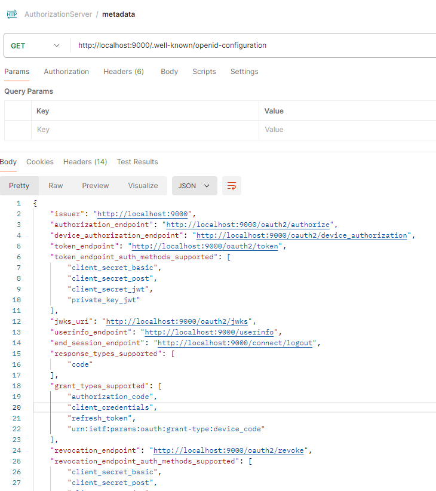
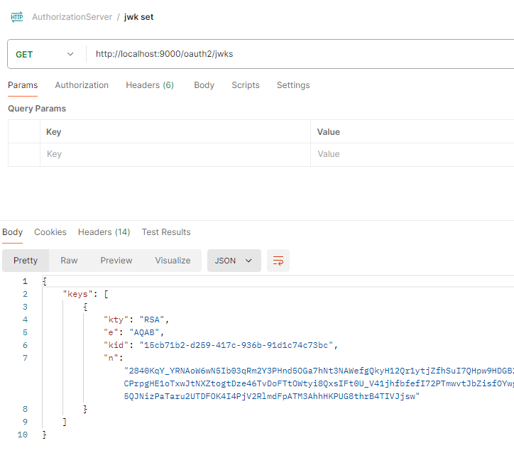

<nav>
    <a href="../.." target="_blank">[Spring Security OAuth2]</a>
</nav>

# 19.10 인가서버 메타데이터 & JWKSet 엔드포인트

---

## 1. 메타데이터 엔드포인트

### 1.1 OAuth2AuthorizationServerMetadataEndpointConfigurer
```java
	@Override
	void init(HttpSecurity httpSecurity) {
		this.requestMatcher = new AntPathRequestMatcher(
				"/.well-known/oauth-authorization-server", HttpMethod.GET.name());
	}

	@Override
	void configure(HttpSecurity httpSecurity) {
		OAuth2AuthorizationServerMetadataEndpointFilter authorizationServerMetadataEndpointFilter =
				new OAuth2AuthorizationServerMetadataEndpointFilter();
		Consumer<OAuth2AuthorizationServerMetadata.Builder> authorizationServerMetadataCustomizer = getAuthorizationServerMetadataCustomizer();
		if (authorizationServerMetadataCustomizer != null) {
			authorizationServerMetadataEndpointFilter.setAuthorizationServerMetadataCustomizer(authorizationServerMetadataCustomizer);
		}
		httpSecurity.addFilterBefore(postProcess(authorizationServerMetadataEndpointFilter), AbstractPreAuthenticatedProcessingFilter.class);
	}
```
- OAuth2AuthorizationServerMetadataEndpointFilter 를 구성한다.
    - 엔드포인트 설정: GET `/.well-known/oauth-authorization-server` (변경 불가, 표준임)
    - 커스텀 설정 적용: AuthorizationServerMetadataCustomizer

### 1.2 OAuth2AuthorizationServerMetadataEndpointFilter
```java
	@Override
	protected void doFilterInternal(HttpServletRequest request, HttpServletResponse response, FilterChain filterChain)
			throws ServletException, IOException {

		if (!this.requestMatcher.matches(request)) {
			filterChain.doFilter(request, response);
			return;
		}

		AuthorizationServerContext authorizationServerContext = AuthorizationServerContextHolder.getContext();
		String issuer = authorizationServerContext.getIssuer();
		AuthorizationServerSettings authorizationServerSettings = authorizationServerContext.getAuthorizationServerSettings();

		OAuth2AuthorizationServerMetadata.Builder authorizationServerMetadata = OAuth2AuthorizationServerMetadata.builder()
				.issuer(issuer)
				.authorizationEndpoint(asUrl(issuer, authorizationServerSettings.getAuthorizationEndpoint()))
				.deviceAuthorizationEndpoint(asUrl(issuer, authorizationServerSettings.getDeviceAuthorizationEndpoint()))
				.tokenEndpoint(asUrl(issuer, authorizationServerSettings.getTokenEndpoint()))
				.tokenEndpointAuthenticationMethods(clientAuthenticationMethods())
				.jwkSetUrl(asUrl(issuer, authorizationServerSettings.getJwkSetEndpoint()))
				.responseType(OAuth2AuthorizationResponseType.CODE.getValue())
				.grantType(AuthorizationGrantType.AUTHORIZATION_CODE.getValue())
				.grantType(AuthorizationGrantType.CLIENT_CREDENTIALS.getValue())
				.grantType(AuthorizationGrantType.REFRESH_TOKEN.getValue())
				.grantType(AuthorizationGrantType.DEVICE_CODE.getValue())
				.tokenRevocationEndpoint(asUrl(issuer, authorizationServerSettings.getTokenRevocationEndpoint()))
				.tokenRevocationEndpointAuthenticationMethods(clientAuthenticationMethods())
				.tokenIntrospectionEndpoint(asUrl(issuer, authorizationServerSettings.getTokenIntrospectionEndpoint()))
				.tokenIntrospectionEndpointAuthenticationMethods(clientAuthenticationMethods())
				.codeChallengeMethod("S256");

		this.authorizationServerMetadataCustomizer.accept(authorizationServerMetadata);

		ServletServerHttpResponse httpResponse = new ServletServerHttpResponse(response);
		this.authorizationServerMetadataHttpMessageConverter.write(
				authorizationServerMetadata.build(), MediaType.APPLICATION_JSON, httpResponse);
	}
```
- AuthorizationServerContext : 인가서버의 런타임 환경설정 정보
- 메타데이터 제공을 위한 여러가지 정보 구성이 일어남
- authorizationServerMetadataCustomizer.accept : 커스터마이저 설정이 있을 경우 여기서 적용됨
- `authorizationServerMetadataHttpMessageConverter.write` : HTTP 응답 메시지 작성

---

## 2. JWKSet 엔드포인트

### 2.1 OAuth2AuthorizationServerConfigurer
```java
	@Override
	public void configure(HttpSecurity httpSecurity) {
		this.configurers.values().forEach(configurer -> configurer.configure(httpSecurity));

		AuthorizationServerSettings authorizationServerSettings = OAuth2ConfigurerUtils.getAuthorizationServerSettings(httpSecurity);

		AuthorizationServerContextFilter authorizationServerContextFilter = new AuthorizationServerContextFilter(authorizationServerSettings);
		httpSecurity.addFilterAfter(postProcess(authorizationServerContextFilter), SecurityContextHolderFilter.class);

		JWKSource<com.nimbusds.jose.proc.SecurityContext> jwkSource = OAuth2ConfigurerUtils.getJwkSource(httpSecurity);
		if (jwkSource != null) {
			NimbusJwkSetEndpointFilter jwkSetEndpointFilter = new NimbusJwkSetEndpointFilter(
					jwkSource, authorizationServerSettings.getJwkSetEndpoint());
			httpSecurity.addFilterBefore(postProcess(jwkSetEndpointFilter), AbstractPreAuthenticatedProcessingFilter.class);
		}
	}
```
- NimbusJwkSetEndpointFilter 설정이 일어남
- JWK Set 엔드포인트는 `JWKSource<com.nimbusds.jose.proc.SecurityContext>` 빈이 등록된 경우에만 구성된다.

### 2.2 NimbusJwkSetEndpointFilter
```java
	@Override
	protected void doFilterInternal(HttpServletRequest request, HttpServletResponse response, FilterChain filterChain)
			throws ServletException, IOException {

		if (!this.requestMatcher.matches(request)) {
			filterChain.doFilter(request, response);
			return;
		}

		JWKSet jwkSet;
		try {
			jwkSet = new JWKSet(this.jwkSource.get(this.jwkSelector, null));
		}
		catch (Exception ex) {
			throw new IllegalStateException("Failed to select the JWK(s) -> " + ex.getMessage(), ex);
		}

		response.setContentType(MediaType.APPLICATION_JSON_VALUE);
		try (Writer writer = response.getWriter()) {
			writer.write(jwkSet.toString());	// toString() excludes private keys
		}
	}
```
- JwkSource 를 가져와서 JWKSet 객체를 구성하고 이를 Http 응답을 통해 제공한다.
- Write 단계에서 public Key만 노출된다

---

## 3. 실습

### 3.1 메타데이터 엔드포인트


- `http://localhost:9000/.well-known/oauth-authorization-server`
- 메타데이터가 노출된다.
- issuerUri 를 Spring Security OAuth2 Client 애플리케이션에 제공하면 이 엔드포인트에 접근하여
클라이언트 설정을 구성한다.

### 3.2 JWKSet 엔드포인트


- `http://localhost:9000/oauth2/jwks`
- 인가서버에 등록된 JWK 목록의 공개키만 노출된다.
- 클라이언트에서는 이 정보를 이용해 openid connect 방식의 IDToken 검증에 사용할 수 있다. (디코딩)
- OAuth2 Resource Server 에서는 이 정보를 이용해 JWT 를 디코딩하고 검증에 사용할 수 있다.

---
