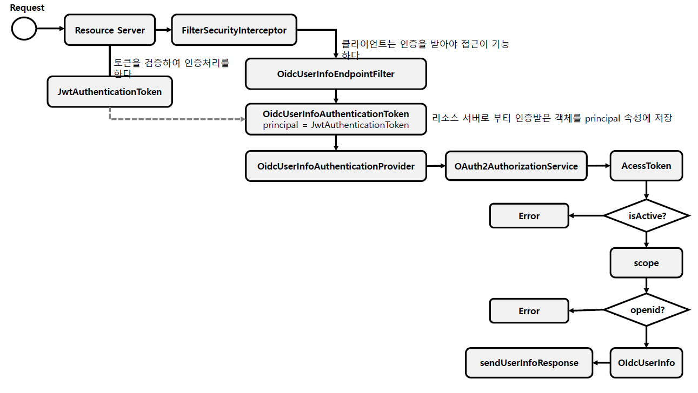

<nav>
    <a href="../.." target="_blank">[Spring Security OAuth2]</a>
</nav>

# 19.11 Oidc 인가서버 메타데이터 & 사용자 정보 엔드포인트

---

## 1. OidcConfigurer
- 기본적으로 OAuth2AuthorizationServerConfigurer 설정에 포함되어있지 않다.
- `OAuth2AuthorizationServerConfigurer.oidc(...)` 를 호출하여 설정에 포함시킬 수 있다.
- 포함 설정
  - OidcProviderConfigurationEndpointConfigurer
  - OidcLogoutEndpointConfigurer
  - OidcUserInfoEndpointConfigurer
  - OidcClientRegistrationEndpointConfigurer (선택)

---

## 2. Oidc 인가서버 메타데이터 엔드포인트
OpenID Connect 1.0 Provider Configuration 엔드포인트 지원

### 2.1 OidcProviderConfigurationEndpointConfigurer
```java
	@Override
	void init(HttpSecurity httpSecurity) {
		this.requestMatcher = new AntPathRequestMatcher(
				"/.well-known/openid-configuration", HttpMethod.GET.name());
	}

	@Override
	void configure(HttpSecurity httpSecurity) {
		OidcProviderConfigurationEndpointFilter oidcProviderConfigurationEndpointFilter =
				new OidcProviderConfigurationEndpointFilter();
		Consumer<OidcProviderConfiguration.Builder> providerConfigurationCustomizer = getProviderConfigurationCustomizer();
		if (providerConfigurationCustomizer != null) {
			oidcProviderConfigurationEndpointFilter.setProviderConfigurationCustomizer(providerConfigurationCustomizer);
		}
		httpSecurity.addFilterBefore(postProcess(oidcProviderConfigurationEndpointFilter), AbstractPreAuthenticatedProcessingFilter.class);
	}
```
- 엔드포인트: `/.well-known/openid-configuration` GET
- 필터 설정: OidcProviderConfigurationEndpointFilter

### 2.2 OidcProviderConfigurationEndpointFilter
```java
	@Override
	protected void doFilterInternal(HttpServletRequest request, HttpServletResponse response, FilterChain filterChain)
			throws ServletException, IOException {

		if (!this.requestMatcher.matches(request)) {
			filterChain.doFilter(request, response);
			return;
		}

		AuthorizationServerContext authorizationServerContext = AuthorizationServerContextHolder.getContext();
		String issuer = authorizationServerContext.getIssuer();
		AuthorizationServerSettings authorizationServerSettings = authorizationServerContext.getAuthorizationServerSettings();

		OidcProviderConfiguration.Builder providerConfiguration = OidcProviderConfiguration.builder()
				.issuer(issuer)
				.authorizationEndpoint(asUrl(issuer, authorizationServerSettings.getAuthorizationEndpoint()))
				.deviceAuthorizationEndpoint(asUrl(issuer, authorizationServerSettings.getDeviceAuthorizationEndpoint()))
				.tokenEndpoint(asUrl(issuer, authorizationServerSettings.getTokenEndpoint()))
				.tokenEndpointAuthenticationMethods(clientAuthenticationMethods())
				.jwkSetUrl(asUrl(issuer, authorizationServerSettings.getJwkSetEndpoint()))
				.userInfoEndpoint(asUrl(issuer, authorizationServerSettings.getOidcUserInfoEndpoint()))
				.endSessionEndpoint(asUrl(issuer, authorizationServerSettings.getOidcLogoutEndpoint()))
				.responseType(OAuth2AuthorizationResponseType.CODE.getValue())
				.grantType(AuthorizationGrantType.AUTHORIZATION_CODE.getValue())
				.grantType(AuthorizationGrantType.CLIENT_CREDENTIALS.getValue())
				.grantType(AuthorizationGrantType.REFRESH_TOKEN.getValue())
				.grantType(AuthorizationGrantType.DEVICE_CODE.getValue())
				.tokenRevocationEndpoint(asUrl(issuer, authorizationServerSettings.getTokenRevocationEndpoint()))
				.tokenRevocationEndpointAuthenticationMethods(clientAuthenticationMethods())
				.tokenIntrospectionEndpoint(asUrl(issuer, authorizationServerSettings.getTokenIntrospectionEndpoint()))
				.tokenIntrospectionEndpointAuthenticationMethods(clientAuthenticationMethods())
				.codeChallengeMethod("S256")
				.subjectType("public")
				.idTokenSigningAlgorithm(SignatureAlgorithm.RS256.getName())
				.scope(OidcScopes.OPENID);

		this.providerConfigurationCustomizer.accept(providerConfiguration);

		ServletServerHttpResponse httpResponse = new ServletServerHttpResponse(response);
		this.providerConfigurationHttpMessageConverter.write(
				providerConfiguration.build(), MediaType.APPLICATION_JSON, httpResponse);
	}
```
- OAuth2AuthorizationServerMetadataEndpointFilter 에서 제공하는 정보에 덧붙여서 더 많은 메타데이터 정보가 제공된다.
  - scope 로 openid 정보가 추가됨
  - ID 토큰 서명 알고리즘: RS256
  - ...

---

## 3. Oidc 사용자 정보 엔드포인트

- OpenID Connect 1.0 UserInfo 엔드포인트

### 3.1 사용자 인증 필요
```kotlin
            oauth2ResourceServer {
                jwt { }
            }
```
```kotlin
    /**
     * UserInfo 엔드포인트 접근 시 Jwt 검증이 필요한데 이를 위해 필요
     */
    @Bean
    fun jwtDecoder(jwkSource: JWKSource<SecurityContext>): JwtDecoder {
        return OAuth2AuthorizationServerConfiguration.jwtDecoder(jwkSource)
    }
```
- 사용자 정보를 얻어와아므로 사용자 인증이 필요하다. (AuthorizationFilter 뒤에 있음)
- Jwt 기반으로 사용자 인증을 한다면 이 부분은 BearerTokenAuthenticationFilter 를 통해 수행된다.
  - 이 설정을 위해서는 JwtDecoder 등록 및 OAuth2ResourceServer API 를 활성화해야한다.

### 3.2 OidcUserInfoEndpointConfigurer
```java
	@Override
	void init(HttpSecurity httpSecurity) {
		AuthorizationServerSettings authorizationServerSettings = OAuth2ConfigurerUtils.getAuthorizationServerSettings(httpSecurity);
		String userInfoEndpointUri = authorizationServerSettings.getOidcUserInfoEndpoint();
		this.requestMatcher = new OrRequestMatcher(
				new AntPathRequestMatcher(userInfoEndpointUri, HttpMethod.GET.name()),
				new AntPathRequestMatcher(userInfoEndpointUri, HttpMethod.POST.name()));

		List<AuthenticationProvider> authenticationProviders = createDefaultAuthenticationProviders(httpSecurity);
		if (!this.authenticationProviders.isEmpty()) {
			authenticationProviders.addAll(0, this.authenticationProviders);
		}
		this.authenticationProvidersConsumer.accept(authenticationProviders);
		authenticationProviders.forEach(authenticationProvider ->
				httpSecurity.authenticationProvider(postProcess(authenticationProvider)));
	}
```
- RequestMatcher 구성
  - GET "/userinfo"
- 기본 AuthenticationProvider 목록 구성
  - OidcUserInfoAuthenticationProvider

```java
	@Override
	void configure(HttpSecurity httpSecurity) {
		AuthenticationManager authenticationManager = httpSecurity.getSharedObject(AuthenticationManager.class);
		AuthorizationServerSettings authorizationServerSettings = OAuth2ConfigurerUtils.getAuthorizationServerSettings(httpSecurity);

		OidcUserInfoEndpointFilter oidcUserInfoEndpointFilter =
				new OidcUserInfoEndpointFilter(
						authenticationManager,
						authorizationServerSettings.getOidcUserInfoEndpoint());
		List<AuthenticationConverter> authenticationConverters = createDefaultAuthenticationConverters();
		if (!this.userInfoRequestConverters.isEmpty()) {
			authenticationConverters.addAll(0, this.userInfoRequestConverters);
		}
		this.userInfoRequestConvertersConsumer.accept(authenticationConverters);
		oidcUserInfoEndpointFilter.setAuthenticationConverter(
				new DelegatingAuthenticationConverter(authenticationConverters));
		if (this.userInfoResponseHandler != null) {
			oidcUserInfoEndpointFilter.setAuthenticationSuccessHandler(this.userInfoResponseHandler);
		}
		if (this.errorResponseHandler != null) {
			oidcUserInfoEndpointFilter.setAuthenticationFailureHandler(this.errorResponseHandler);
		}
		httpSecurity.addFilterAfter(postProcess(oidcUserInfoEndpointFilter), AuthorizationFilter.class);
	}
```
- OidcUserInfoEndpointFilter 구성
  - AuthenticationConverter 구성
    - 익명 AuthenticationConverter : SecurityContext 에서 Authentication 을 꺼내서 OidcUserInfoAuthenticationToken 을 반환
  - successHandler 설정
  - failureHandler 설정

### 3.3 OidcUserInfoEndpointFilter


```java

	@Override
	protected void doFilterInternal(HttpServletRequest request, HttpServletResponse response, FilterChain filterChain)
			throws ServletException, IOException {

		if (!this.userInfoEndpointMatcher.matches(request)) {
			filterChain.doFilter(request, response);
			return;
		}

		try {
			Authentication userInfoAuthentication = this.authenticationConverter.convert(request);

			Authentication userInfoAuthenticationResult =
					this.authenticationManager.authenticate(userInfoAuthentication);

			this.authenticationSuccessHandler.onAuthenticationSuccess(request, response, userInfoAuthenticationResult);
		} catch (OAuth2AuthenticationException ex) {
			if (this.logger.isTraceEnabled()) {
				this.logger.trace(LogMessage.format("User info request failed: %s", ex.getError()), ex);
			}
			this.authenticationFailureHandler.onAuthenticationFailure(request, response, ex);
		} catch (Exception ex) {
			OAuth2Error error = new OAuth2Error(
					OAuth2ErrorCodes.INVALID_REQUEST,
					"OpenID Connect 1.0 UserInfo Error: " + ex.getMessage(),
					"https://openid.net/specs/openid-connect-core-1_0.html#UserInfoError");
			if (this.logger.isTraceEnabled()) {
				this.logger.trace(error.getDescription(), ex);
			}
			this.authenticationFailureHandler.onAuthenticationFailure(request, response,
					new OAuth2AuthenticationException(error));
		} finally {
			SecurityContextHolder.clearContext();
		}
	}
```
- AuthenticationConverter 를 통해 요청 전처리
- OidcUserInfoAuthenticationProvider 를 통해 요청 검증, 사용자 정보 반환
- 성공시 successHandler
  - 사용자 정보 응답
- 실패시 failureHandler
  - 실패 응답 작성

### 3.4 OidcUserInfoAuthenticationProvider
- OidcUserInfoAuthenticationToken 으로부터 액세스 토큰 값을 추출한다.
- OAuthAuthorizationService 에 액세스 토큰을 통해 OAuth2Authorization 을 구해온다.
  - 없으면 예외 발생
- OAuth2Authorization 에 담긴 액세스토큰 객체를 통해 isActive 한지 정보를 확인한다.
  - 유효하지 않으면 예외 발생
- scope 목록에 openid 가 포함되어 있는 지 확인
  - 없으면 예외 발생
- OAuth2Authorization 에 idToken 이 있는 지 확인
  - 없으면 예외 발생
- OidcUserInfo 구성
  - AccessToken, 내부에 저장된 IdToken, Scope 정보를 기반으로 하여 사용자 정보를 구성한다.
- OidcUserInfoAuthenticationToken 반환

---
