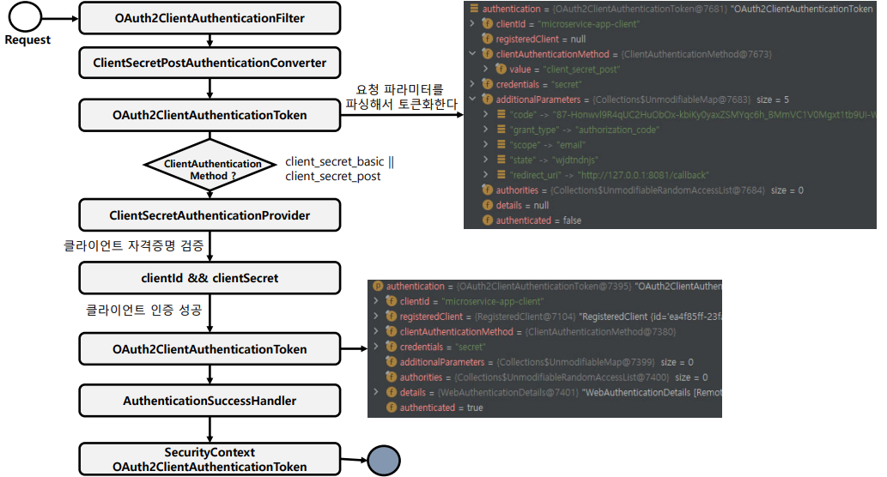

<nav>
    <a href="../.." target="_blank">[Spring Security OAuth2]</a>
</nav>

# 19.3 clientAuthentication() - 클라이언트 인증

---

## 1. OAuth2ClientAuthenticationConfigurer
- OAuth2 클라이언트 인증을 위한 사용자 정의하는 기능을 제공한다.
- 클라이언트 인증 요청에 대한 전처리, 기본 처리 및 후처리 로직을 커스텀하게 구현할 수 있도록 API를 지원한다
- OAuth2ClientAuthenticationFilter 를 구성하고 이를 OAuth2 인증 서버 SecurityFilterChain 빈에 등록한다
- 지원되는 클라이언트 인증 방법은 client_secret_basic, client_secret_post, private_key_jwt, client_secret_jwt및 none(공개 클라이언트) 이다

### 1.1 init
```java
	@Override
	void init(HttpSecurity httpSecurity) {
		AuthorizationServerSettings authorizationServerSettings = OAuth2ConfigurerUtils.getAuthorizationServerSettings(httpSecurity);
		this.requestMatcher = new OrRequestMatcher(
				new AntPathRequestMatcher(
						authorizationServerSettings.getTokenEndpoint(),
						HttpMethod.POST.name()),
				new AntPathRequestMatcher(
						authorizationServerSettings.getTokenIntrospectionEndpoint(),
						HttpMethod.POST.name()),
				new AntPathRequestMatcher(
						authorizationServerSettings.getTokenRevocationEndpoint(),
						HttpMethod.POST.name()),
				new AntPathRequestMatcher(
						authorizationServerSettings.getDeviceAuthorizationEndpoint(),
						HttpMethod.POST.name()));

		List<AuthenticationProvider> authenticationProviders = createDefaultAuthenticationProviders(httpSecurity);
		if (!this.authenticationProviders.isEmpty()) {
			authenticationProviders.addAll(0, this.authenticationProviders);
		}
		this.authenticationProvidersConsumer.accept(authenticationProviders);
		authenticationProviders.forEach(authenticationProvider ->
				httpSecurity.authenticationProvider(postProcess(authenticationProvider)));
	}
```
- RequestMatcher 설정
- AuthenticationProvider 목록을 가져와서 HttpSecurity에 등록

### 1.2 configure
```java
	@Override
	void configure(HttpSecurity httpSecurity) {
		AuthenticationManager authenticationManager = httpSecurity.getSharedObject(AuthenticationManager.class);
		OAuth2ClientAuthenticationFilter clientAuthenticationFilter = new OAuth2ClientAuthenticationFilter(
				authenticationManager, this.requestMatcher);
		List<AuthenticationConverter> authenticationConverters = createDefaultAuthenticationConverters();
		if (!this.authenticationConverters.isEmpty()) {
			authenticationConverters.addAll(0, this.authenticationConverters);
		}
		this.authenticationConvertersConsumer.accept(authenticationConverters);
		clientAuthenticationFilter.setAuthenticationConverter(
				new DelegatingAuthenticationConverter(authenticationConverters));
		if (this.authenticationSuccessHandler != null) {
			clientAuthenticationFilter.setAuthenticationSuccessHandler(this.authenticationSuccessHandler);
		}
		if (this.errorResponseHandler != null) {
			clientAuthenticationFilter.setAuthenticationFailureHandler(this.errorResponseHandler);
		}
		httpSecurity.addFilterAfter(postProcess(clientAuthenticationFilter), AbstractPreAuthenticatedProcessingFilter.class);
	}
```
- OAuth2ClientAuthenticationFilter 구성
  - AuthenticationManager 설정
  - RequestMatcher 설정
  - DelegatingAuthenticationConverter 설정
  - AuthenticationSuccessHandler 설정
  - AuthenticationFailureHandler 설정

---

## 2. OAuth2ClientAuthenticationFilter
- 클라이언트 인증 요청을 처리하는 필터이다.
- 기본구성
  - DelegatingAuthenticationConverter
    - ClientSecretBasicAuthenticationConverter – 클라이언트 요청 방식이 HTTP Basic 일 경우 처리
    - ClientSecretPostAuthenticationConverter – 클라이언트 요청 방식이 POST 일 경우 처리
    - JwtClientAssertionAuthenticationConverter - 클라이언트 요청 방식이 JWT 토큰일 경우 처리
    - PublicClientAuthenticationConverter - 클라이언트 요청 방식이 PKCE 일 경우 처리
  - DelegatingAuthenticationProvider
    - ClientSecretAuthenticationProvider, JwtClientAssertionAuthenticationProvider, PublicClientAuthenticationProvider
      - 권한 부여 유형에 따라 토큰을 발행하는 AuthenticationProvider 구현체이다
  - AuthenticationSuccessHandler - 인증된 OAuth2ClientAuthenticationToken 에 SecurityContext 를 연결하는 내부 구현체 
  - AuthenticationFailureHandler – 연결된 OAuth2AuthenticationException 를 사용하여 OAuth2 오류 응답을 반환하는 내부 구현체
- RequestMatcher
  - POST `/oauth2/token` : 토큰 발급
  - POST `/oauth2/introspect`  : 토큰 검증
  - POST `/oauth2/revoke` : 토큰 취소
  - POST `/oauth2/device_authorization` : 디바이스 권한부여

---

## 3. `clientAuthentication()`
- authenticationConverter


---

## 4. 클라이언트 인증 흐름


### 4.1 OAuth2ClientAuthenticationFilter 흐름
```java

	@Override
	protected void doFilterInternal(HttpServletRequest request, HttpServletResponse response, FilterChain filterChain)
			throws ServletException, IOException {

		if (!this.requestMatcher.matches(request)) {
			filterChain.doFilter(request, response);
			return;
		}

		try {
			Authentication authenticationRequest = this.authenticationConverter.convert(request);
			if (authenticationRequest instanceof AbstractAuthenticationToken) {
				((AbstractAuthenticationToken) authenticationRequest).setDetails(
						this.authenticationDetailsSource.buildDetails(request));
			}
			if (authenticationRequest != null) {
				validateClientIdentifier(authenticationRequest);
				Authentication authenticationResult = this.authenticationManager.authenticate(authenticationRequest);
				this.authenticationSuccessHandler.onAuthenticationSuccess(request, response, authenticationResult);
			}
			filterChain.doFilter(request, response);

		} catch (OAuth2AuthenticationException ex) {
			if (this.logger.isTraceEnabled()) {
				this.logger.trace(LogMessage.format("Client authentication failed: %s", ex.getError()), ex);
			}
			this.authenticationFailureHandler.onAuthenticationFailure(request, response, ex);
		}
	}
```
- RequestMatcher : 요청 매칭되는 지 확인하여, 매칭되면 요청을 가로채고 아닐 경우 doFilter를 호출하여 다음 필터로 넘기기
- authenticationConverter : 요청을 Authentication 으로 변경(요청 객체)
  - DelegatingAuthenticationConverter 가 작동한다. 이것은 내부적으로 ClientSecretBasicAuthenticationConverter 와 같은 하위 converter 들을
  가지고 있다.
  - 각 converter 를 순회하면서 가장 먼저 반환되는 객체를 return 한다
- validateClientIdentifier : OAuth2ClientAuthenticationToken 의 인스턴스가 아닐 경우 예외 발생
- AuthenticationManager.authenticate : 클라이언트 인증 실질적 처리
  - 내부적으로 ProviderManager 가 작동하고 이것은 ClientSecretAuthenticationProvider, JwtClientAssertionAuthenticationProvider, PublicClientAuthenticationProvider 를
  기본적으로 가지고 있다.
- authenticationSuccessHandler.onAuthenticationSuccess : 성공 후속처리
  - 기본적으로 SecurityContext 에 인증 객체를 저장하여 이후의 로직에서 사용할 수 있게 한다
- authenticationFailureHandler.onAuthenticationFailure : 실패 후속 처리
  - SecurityContext 의 인증을 말소하고 예외 응답을 내려준다.

### 4.2 예시 - ClientSecretBasicAuthenticationConverter
```java

		String clientID;
		String clientSecret;
		try {
			clientID = URLDecoder.decode(credentials[0], StandardCharsets.UTF_8.name());
			clientSecret = URLDecoder.decode(credentials[1], StandardCharsets.UTF_8.name());
		} catch (Exception ex) {
			throw new OAuth2AuthenticationException(new OAuth2Error(OAuth2ErrorCodes.INVALID_REQUEST), ex);
		}

		return new OAuth2ClientAuthenticationToken(clientID, ClientAuthenticationMethod.CLIENT_SECRET_BASIC, clientSecret,
				OAuth2EndpointUtils.getParametersIfMatchesAuthorizationCodeGrantRequest(request));
	}
```
- 요청 파라미터를 파싱하여 문법에 오류가 없는 지 등을 확인하고, OAuth2ClientAuthenticationToken 을 생성한다.

### 4.2 ClientSecretAuthenticationProvider
```java
	@Override
	public Authentication authenticate(Authentication authentication) throws AuthenticationException {
		OAuth2ClientAuthenticationToken clientAuthentication =
				(OAuth2ClientAuthenticationToken) authentication;

		if (!ClientAuthenticationMethod.CLIENT_SECRET_BASIC.equals(clientAuthentication.getClientAuthenticationMethod()) &&
				!ClientAuthenticationMethod.CLIENT_SECRET_POST.equals(clientAuthentication.getClientAuthenticationMethod())) {
			return null;
		}

		String clientId = clientAuthentication.getPrincipal().toString();
		RegisteredClient registeredClient = this.registeredClientRepository.findByClientId(clientId);
		if (registeredClient == null) {
			throwInvalidClient(OAuth2ParameterNames.CLIENT_ID);
		}

		if (this.logger.isTraceEnabled()) {
			this.logger.trace("Retrieved registered client");
		}

		if (!registeredClient.getClientAuthenticationMethods().contains(
				clientAuthentication.getClientAuthenticationMethod())) {
			throwInvalidClient("authentication_method");
		}

		if (clientAuthentication.getCredentials() == null) {
			throwInvalidClient("credentials");
		}

		String clientSecret = clientAuthentication.getCredentials().toString();
		if (!this.passwordEncoder.matches(clientSecret, registeredClient.getClientSecret())) {
			if (this.logger.isDebugEnabled()) {
				this.logger.debug(LogMessage.format("Invalid request: client_secret does not match" +
						" for registered client '%s'", registeredClient.getId()));
			}
			throwInvalidClient(OAuth2ParameterNames.CLIENT_SECRET);
		}

		if (registeredClient.getClientSecretExpiresAt() != null &&
				Instant.now().isAfter(registeredClient.getClientSecretExpiresAt())) {
			throwInvalidClient("client_secret_expires_at");
		}

		if (this.passwordEncoder.upgradeEncoding(registeredClient.getClientSecret())) {
			registeredClient = RegisteredClient.from(registeredClient)
					.clientSecret(this.passwordEncoder.encode(clientSecret))
					.build();
			this.registeredClientRepository.save(registeredClient);
		}

		if (this.logger.isTraceEnabled()) {
			this.logger.trace("Validated client authentication parameters");
		}

		// Validate the "code_verifier" parameter for the confidential client, if available
		this.codeVerifierAuthenticator.authenticateIfAvailable(clientAuthentication, registeredClient);

		if (this.logger.isTraceEnabled()) {
			this.logger.trace("Authenticated client secret");
		}

		return new OAuth2ClientAuthenticationToken(registeredClient,
				clientAuthentication.getClientAuthenticationMethod(), clientAuthentication.getCredentials());
	}
```
- registeredClientRepository 를 통해 RegisteredClient 를 조회해온다.
- 클라이언트가 요청한 authentication_method 방식과 RegisteredClient에 설정한 authentication_method 가 호환이 되는지 확인
- clientSecret 의 유효성 검증
- codeVerifierAuthenticator.authenticateIfAvailable
  - PKCE 가 적용됐다면 PKCE 검증도 수행한다. PKCE 가 적용되지 않았다면 false 를 반환(무시)
    - authorizationService 를 통해 최종 사용자가 코드 발급 요청 시 저장해둔 OAuth2Authorization 를 조회
      - 여기서 codeChallenge, codeChallengeMethod 를 추출
  - clientAuthentication 에서 code_verifier 추출
  - codeVerifier 가 유효한 값인지 검증한다. 유효하지 않으면 예외 발생
- 여기까지 검증이 제대로 잘 됐다면 성공적으로 OAuth2ClientAuthenticationToken 을 반환한다.

---
