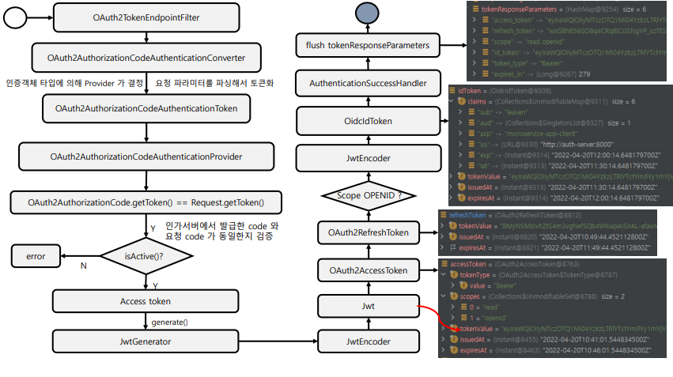
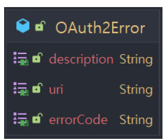

<nav>
    <a href="../.." target="_blank">[Spring Security OAuth2]</a>
</nav>

# 19.4 Authorization Code Grant Type - 토큰 발급

---

## 1. Authorization Code Grant 흐름


- OAuth2ClientAuthenticationFilter 에서 인증을 해야만 OAuth2TokenEndpointFilter 에 접근할 수 있다
- OAuth2TokenEndpointFilter 에서 토큰 발급 처리를 수행한다.
- OAuth2AuthorizationCodeAuthenticationConverter 가 작동하여 미인증 객체를 생성한다.
  - 이 흐름에서는 OAuth2AuthorizationCodeAuthenticationToken 가 생성된다.
- AuthenticationManager 에 이 미인증 객체를 전달하여 인증 처리를 위임한다.
  - ProviderManager 는 여러개의 AuthenticationProvider 를 가지고 있다.
  - 이 흐름에서는 OAuth2AuthorizationCodeAuthenticationProvider 가 작동한다.
- 인증에 성공하면 authenticationSuccessHandler 가 작동: 토큰 발급
- 인증에 실패하면 authenticationFailureHandler 가 작동: 오류 응답

---

## 2. OAuth2AuthorizationCodeAuthenticationConverter
- 요청 파라미터에서 grant_type 을 추출하고 이 값이 authorization_code 가 아니면 null 을 반환하여 다음 converter 에 처리를 위임
- 필수적인 파라미터들을 추출한다. 이 과정에서 문법적 문제가 없는 지도 검증한다.
  - code가 있는 지 검사
  - redirect_uri 가 있는 지 검사
- SecurityContextHolder 에서 인증객체를 가져온다.
- OAuth2AuthorizationCodeAuthenticationToken 를 구성한다.

---

## 3. OAuth2AuthorizationCodeAuthenticationProvider
- authorizationService 에 code 를 전달하여, 일치하는 OAuth2Authorization 을 찾아온다.
  - 이 과정에서 일차하는 OAuth2Authorization 이 없으면 예외가 발생한다.
- 현재 인증된 클라이언트의 RegisteredClient 를 통해 client_id 를 추출하고 이 값이 OAuth2Authorization 이 가지고 있는 client_id 와
일치하는 지 검증한다.
  - 일치하지않으면
    - OAuth2Authorization 의 code 가 유효한 지도 확인하여, 유효하지 않으면 OAuth2Authorization 을 invalidate(무효화) 시킨다.
    - 예외를 발생시킨다.
- redirect_uri 가 일치하는 지 검증한다.
- authorizationCode 가 유효한지 검증한다.
- 토큰 발급 절차에 들어간다.
  - OAuth2TokenContext 을 구성
  - AccessToken 구성
    - tokenGenerator 를 통해 OAuth2Token 구성
    - 이를 기반으로 OAuth2AccessToken 구성
  - registeredClient 의 authorization_grant_types 에 refresh_token 이 있다면 RefreshToken 역시 구성
  - 현재 토큰 발급 요청의 scope 목록에 open_id 가 있으면 OidcIdToken 역시 구성
- OAuth2Authorization 의 code 를 무효화한다.
- OAuth2Authorization 정보를 갱신한다.
- OAuth2AccessTokenAuthenticationToken 를 발급한다.

---

## 4. OAuth2TokenGenerator

### 4.1 인터페이스
```java
@FunctionalInterface
public interface OAuth2TokenGenerator<T extends OAuth2Token> {

	@Nullable
	T generate(OAuth2TokenContext context);

}
```
- OAuth2TokenContext 를 전달받으면 이를 기반으로 OAuth2Token 을 발급할 책임을 가진다.

### 4.2 DelegatingOAuth2TokenGenerator
```java
public final class DelegatingOAuth2TokenGenerator implements OAuth2TokenGenerator<OAuth2Token> {
	private final List<OAuth2TokenGenerator<OAuth2Token>> tokenGenerators;

	@Nullable
	@Override
	public OAuth2Token generate(OAuth2TokenContext context) {
		for (OAuth2TokenGenerator<OAuth2Token> tokenGenerator : this.tokenGenerators) {
			OAuth2Token token = tokenGenerator.generate(context);
			if (token != null) {
				return token;
			}
		}
		return null;
	}
```
- DelegatingOAuth2TokenGenerator 가 기본 구현체이다.
- OAuth2TokenGenerator 를 가지고 있고 순서대로 토큰 발급을 위임하여, 가장 먼저 null 이 아닌 토큰이 발급되면 응답한다.

### 4.3 JwtGenerator
- 작동 조건: OAuth2TokenContext 의 tokenType 이 accessToken 이거나, idToken
    - AccessToken 일 경우 registeredClient 의 AccessToken 포맷 설정이 self-contained 이어야 함(JWT). 아닐 경우 Opaque 토큰으로 간주됨
- JwtEncoder 를 이용하여 Jwt 를 구성
  - 내부적으로 NimbusJwtEncoder 가 작동한다.
- Jwt 반환

---

## 5. 응답

### 5.1 성공 응답
```text
HTTP/1.1 200 OK
Content-Type: application/json
Cache-Control: no-store // 액세스 토큰으로 응답할 때 서버는 클라이언트가 이 요청을 캐시하지 않도록 HTTP 헤더에 포함해야 함
{
    "access_token":"MTQ0NjJkZmQ5OTM2NDE1ZTZjNGZmZjI3",
    "token_type":"Bearer",
    "expires_in":3600,
    "refresh_token":"IwOGYzYTlmM2YxOTQ5MGE3YmNmMDFkNTVk",
    "scope":"create"
}
```
- access_token(필수): 권한 부여 서버에서 발급한 액세스 토큰 문자열
- token_type(필수): 토큰 유형은 일반적으로 "Bearer" 문자열
- expires_in(권장): 토큰의 만료시간
- refresh_token(선택 사항): 액세스 토큰이 만료되면 응용 프로그램이 다른 액세스 토큰을 얻는 데 사용할 수 있는 Refresh 토큰을 반환하는 것이 유용
하다.
  - 단, implicit 권한 부여로 발행된 토큰은 새로고침 토큰을 발행할 수 없다.
- scope(선택사항): 사용자가 부여한 범위가 앱이 요청한 범위와 동일한 경우 이 매개변수는 선택사항.
  - 사용자가 부여한 범위가 요청된 범위와 다른 경우 이 매개변수가 필요함


### 5.2 실패 응답


```text
HTTP/1.1 400 Bad Request
Content-Type: application/json
Cache-Control: no-store
    {
    "error": "invalid_request",
    "error_description": "Request was missing the 'redirect_uri' parameter.",
    "error_uri": "See the full API docs at https://authorization-server.com/docs/access_token"
    }
```
- errorCode
  - invalid_request: 요청에 매개변수가 누락, 지원되지 않는 매개변수, 매개변수 반복되는 경우 서버가 요청을 진행할 수 없음
  - invalid_client: 요청에 잘못된 클라이언트 ID 또는 암호가 포함된 경우 클라이언트 인증에 실패, HTTP 401 응답
  - invalid_grant: 인증 코드가 유효하지 않거나 만료됨
    - 권한 부여에 제공된 리디렉션 URL이 액세스 토큰 요청에 제공된 URL과 일치하지 않는 경우 반환하는 오류
  - invalid_scope: 범위를 포함하는 액세스 토큰 요청의 경우 이 오류는 요청의 유효하지 않은 범위 값을 나타냄
  - unauthorized_client: 이 클라이언트는 요청된 권한 부여 유형을 사용할 권한이 없음(RegisteredClient 에 정의하지 않은 권한 부여 유형을 요청한 경우)
  - unsupported_grant_type: 권한 부여 서버가 인식하지 못하는 승인 유형을 요청하는 경우 이 코드를 사용함

---
