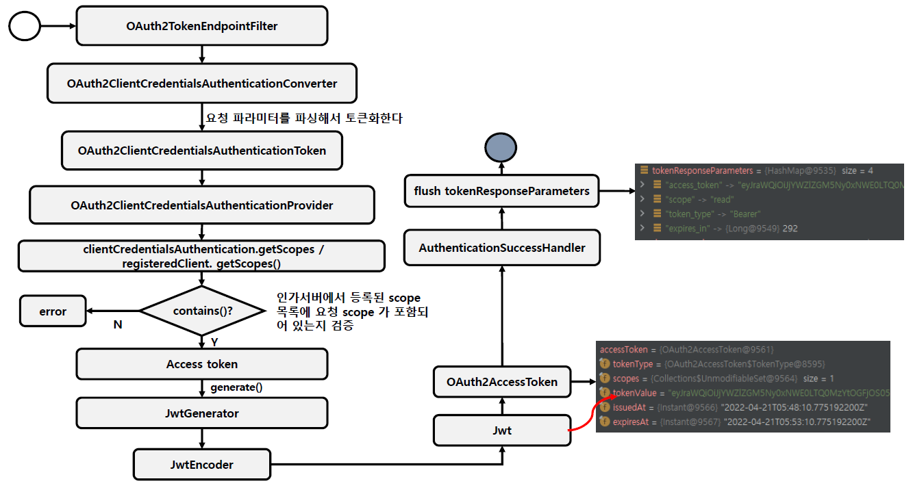

<nav>
    <a href="../.." target="_blank">[Spring Security OAuth2]</a>
</nav>

# 19.5 Client Credentials Grant Type - 토큰 발급

---

## 1. Client Credentials

- OAuth2ClientAuthenticationFilter 에서 인증을 해야만 OAuth2TokenEndpointFilter 에 접근할 수 있다
- OAuth2TokenEndpointFilter 에서 토큰 발급 처리를 수행한다.
- OAuth2ClientCredentialsAuthenticationConverter 가 작동하여 미인증 객체를 생성한다.
    - 이 흐름에서는 OAuth2ClientCredentialsAuthenticationToken 가 생성된다.
- AuthenticationManager 에 이 미인증 객체를 전달하여 인증 처리를 위임한다.
    - ProviderManager 는 여러개의 AuthenticationProvider 를 가지고 있다.
    - 이 흐름에서는 OAuth2ClientCredentialsAuthenticationProvider 가 작동한다.
- 인증에 성공하면 authenticationSuccessHandler 가 작동: 토큰 발급
- 인증에 실패하면 authenticationFailureHandler 가 작동: 오류 응답

---

## 2. OAuth2ClientCredentialsAuthenticationConverter
- 요청 파라미터에서 grant_type 을 추출하고 이 값이 client_credentials 가 아니면 null 을 반환하여 다음 converter 에 처리를 위임
- scope 를 추출하고 파싱하여 map 으로 구성
- OAuth2ClientCredentialsAuthenticationToken 응답

---

## 3. OAuth2ClientCredentialsAuthenticationProvider
- 클라이언트의 인증여부 검증
- 요청한 scope와 registered Client의 scope 목록을 비교 검증
- OAuth2TokenContext 구성
- tokenGenerator 를 통해 Jwt 를 얻어오고 OAuth2AccessToken 구성
- 이 흐름에서는 클라이언트의 access_token 발급만이 목적이므로 refresh_token, id_token 발급은 되지 않는다.
- authorizationService 에 OAuth2Authorization 저장
- OAuth2AccessTokenAuthenticationToken 반환

---
