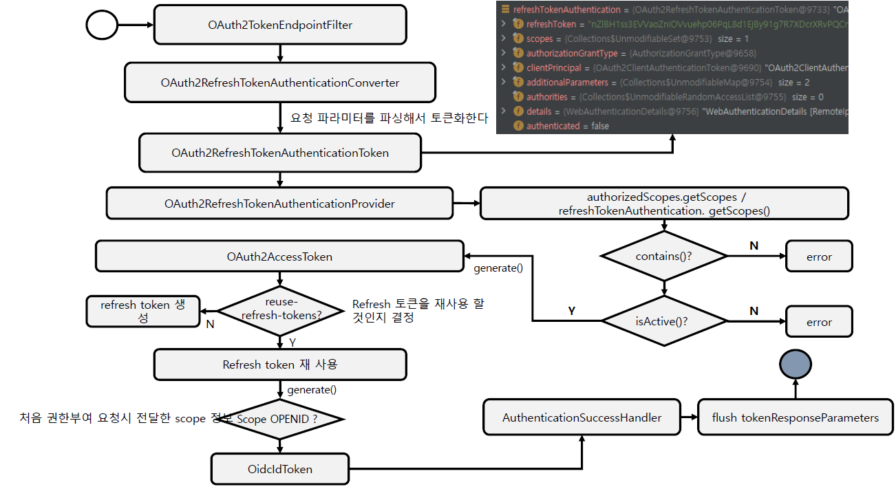

<nav>
    <a href="../.." target="_blank">[Spring Security OAuth2]</a>
</nav>

# 19.6 Refresh Token Grant Type - 토큰 재발급

---

## 1. Refresh Token Flow


- OAuth2ClientAuthenticationFilter 에서 인증을 해야만 OAuth2TokenEndpointFilter 에 접근할 수 있다
- OAuth2TokenEndpointFilter 에서 토큰 재발급 처리를 수행한다.
- OAuth2RefreshTokenAuthenticationConverter 가 작동하여 미인증 객체를 생성한다.
    - 이 흐름에서는 OAuth2RefreshTokenAuthenticationToken 가 생성된다.
- AuthenticationManager 에 이 미인증 객체를 전달하여 인증 처리를 위임한다.
    - ProviderManager 는 여러개의 AuthenticationProvider 를 가지고 있다.
    - 이 흐름에서는 OAuth2RefreshTokenAuthenticationProvider 가 작동한다.
- 인증에 성공하면 authenticationSuccessHandler 가 작동: 토큰 재발급
- 인증에 실패하면 authenticationFailureHandler 가 작동: 오류 응답

---

## 2. OAuth2RefreshTokenAuthenticationConverter

- 요청 파라미터에서 grant_type 을 추출하고 이 값이 refresh_token 이 아니면 null 을 반환하여 다음 converter 에 처리를 위임
- SecurityContextHolder 를 통해 인증 객체(클라이언트) 가져오기
- refresh_token 헤더값을 추출하고, 없으면 예외 발생
- scope 를 추출하고 파싱하여 map 으로 구성
- OAuth2RefreshTokenAuthenticationToken 구성


---

## 3. OAuth2RefreshTokenAuthenticationProvider
- 인증객체에서 RegisteredClient 추출(클라이언트 인증 정보)
- OAuth2AuthorizationService 에 리프레시토큰을 전달하여 OAuth2Authorization 가져오기(최종사용자 인가 정보)
- RegisteredClient 와 oauth2Authorization 의 client_id 비교
  - 다르면 예외 발생
- registeredClient 의 grant_type 허용 범위에 refresh_token 이 포함되어 있는 지 확인
  - 다르면 예외 발생
- 리프레시 토큰이 유효한 지 확인(isActive): 다음 조건에 해당하지 않아야 함
  - invalidated(무효화됐는가)
  - expired(만료됐는가)
  - isBeforeUse(nbf에서 지정한 시간보다 이전인가: 이 시간 이전에는 처리되어선 안 됨)
- scope 추출
  - OAuth2Authorization 현재 요청의 scope 들을 모두 포함하고 있어야 함
  - scope가 비어있을 경우 OAuth2Authorization 이 가진 모든 scope 들을 추출
- 토큰 생성
  - AccessToken
    - OAuth2TokenGenerator.generate -> DelegatingOAuth2TokenGenerator -> JwtGenerator -> Jwt
    - 이 결과를 기반으로 OAuth2AccessToken 객체 구성
  - RefreshToken
    - `getTokenSettings().isReuseRefreshTokens()`: 리프레시 토큰 재사용 여부 확인 -> 재사용할 경우 그대로 발급
    - OAuth2TokenGenerator.generate -> DelegatingOAuth2TokenGenerator -> OAuth2RefreshTokenGenerator -> OAuth2RefreshToken
  - OidcIdToken
    - OAuth2TokenGenerator.generate -> DelegatingOAuth2TokenGenerator -> JwtGenerator -> Jwt
    - 이를 기반으로 OidcIdToken 구성
- OAuth2AuthorizationService 에 저장
- OAuth2AccessTokenAuthenticationToken 반환

---

## 4. 토큰 재갱신 여부 설정
```kotlin
    /**
     * OAuth2 클라이언트 정보 저장 및 관리
     */
    @Bean
    fun registeredClientRepository(): RegisteredClientRepository {
        val registeredClient1 = createRegisteredClient("oauth2-client-app1", "{noop}secret1", "read", "write")
        val registeredClient2 = createRegisteredClient("oauth2-client-app2", "{noop}secret2", "read", "delete")
        val registeredClient3 = createRegisteredClient("oauth2-client-app3", "{noop}secret3", "read", "update")

        return InMemoryRegisteredClientRepository(registeredClient1, registeredClient2, registeredClient3)
    }

    private fun createRegisteredClient(
        clientId: String,
        clientSecret: String,
        vararg scopes: String
    ): RegisteredClient {
        val builder = RegisteredClient.withId(UUID.randomUUID().toString())
            .clientId(clientId)
            .clientSecret(clientSecret)
            .clientName(clientId)
            .clientIdIssuedAt(Instant.now())
            .clientSecretExpiresAt(Instant.MAX)
            .clientAuthenticationMethod(ClientAuthenticationMethod.CLIENT_SECRET_BASIC)
            .clientAuthenticationMethod(ClientAuthenticationMethod.CLIENT_SECRET_POST)
            .authorizationGrantType(AuthorizationGrantType.AUTHORIZATION_CODE)
            .authorizationGrantType(AuthorizationGrantType.CLIENT_CREDENTIALS)
            .authorizationGrantType(AuthorizationGrantType.REFRESH_TOKEN)
            .redirectUri("http://127.0.0.1:8081")
            .scope(OidcScopes.OPENID)
            .scope(OidcScopes.PROFILE)
            .scope(OidcScopes.EMAIL)
            .tokenSettings(TokenSettings.builder().reuseRefreshTokens(false).build()) // 리프레시 토큰 요청 시 리프레시 토큰도 재갱신
            .clientSettings(ClientSettings.builder().requireAuthorizationConsent(true).build())

        if (scopes.isNotEmpty()) {
            scopes.forEach { builder.scope(it) }
        }
        return builder.build()
    }
```
- 클라이언트 등록 단계에서 `.tokenSettings(TokenSettings.builder().reuseRefreshTokens(false).build()) `
  - reuseRefreshTokens(false) : 리프레시 토큰을 통한 토큰 재갱신 시 리프레시 토큰도 재갱신

---
