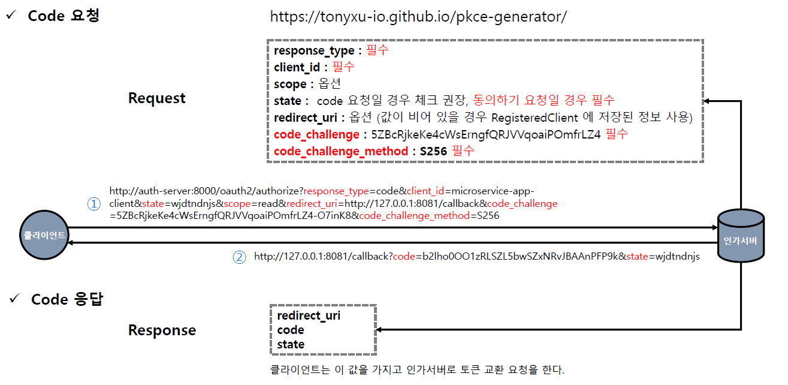
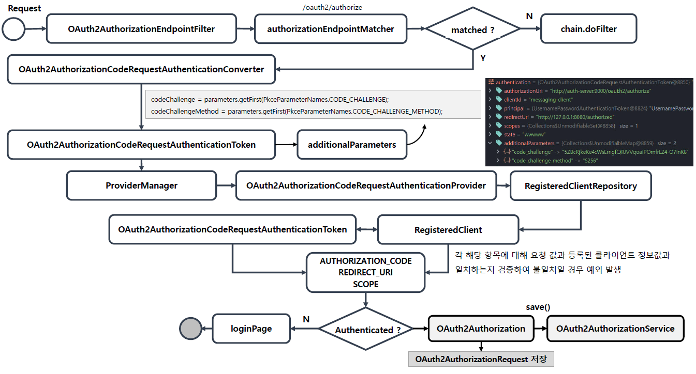
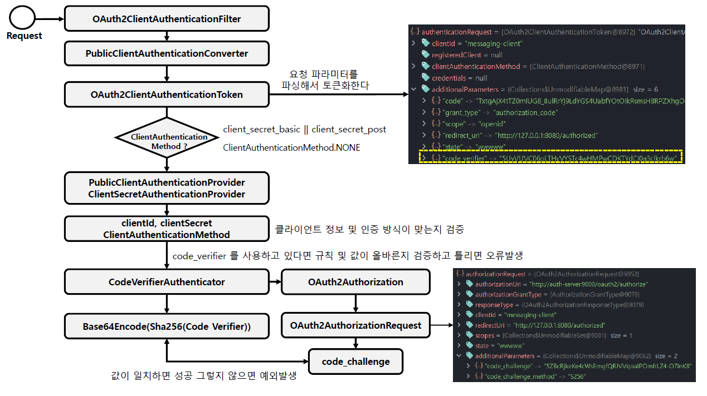

<nav>
    <a href="../.." target="_blank">[Spring Security OAuth2]</a>
</nav>

# 19.7 Authorization Code with PKCE

---

## 1. PKCE 흐름 - 코드 발급


- code 발급 요청 때 code_challenge(해시값), code_challenge_method(알고리즘) 를 함께 보낸다.
  - 서버는 이 정보를 기억해둔다. (OAuth2Authorization)
- code 발급 응답
  - redirect_uri, code, state 를 내려준다.



- code 발급 요청, code 발급 응답을 책임지는 부분은 OAuth2AuthorizationEndpointFilter 이다.
- 동의 전
  - OAuth2AuthorizationCodeRequestAuthenticationConverter
    - 여기서 `code_challenge`, `code_challenge_method` 가 `additionalParameters` 에 저장된다.
  - OAuth2AuthorizationCodeRequestAuthenticationProvider
- 동의 후
  - OAuth2AuthorizationConsentAuthenticationConverter
  - OAuth2AuthorizationConsentAuthenticationProvider

---

## 2. PKCE 흐름 - 클라이언트 인증


- 토큰 발급과 같은 엔드포인트에 접근하기 위해서는 클라이언트 인증이 필요하다. 이는 OAuth2ClientAuthenticationFilter 가 담당한다.
- 기밀 클라이언트
  - Basic 인증: ClientSecretBasicAuthenticationConverter -> ClientSecretAuthenticationProvider
  - Post 인증: ClientSecretPostAuthenticationConverter -> ClientSecretAuthenticationProvider
  - Jwt 인증: JwtClientAssertionAuthenticationConverter -> JwtClientAssertionAuthenticationProvider
- 공개 클라이언트
  - 공개 클라이언트 인증: PublicClientAuthenticationConverter -> PublicClientAuthenticationProvider

---

## 3. 공개 클라이언트

### 3.1 코드 발급: OAuth2AuthorizationCodeRequestAuthenticationConverter
```java
		// code_challenge (REQUIRED for public clients) - RFC 7636 (PKCE)
		String codeChallenge = parameters.getFirst(PkceParameterNames.CODE_CHALLENGE);
		if (StringUtils.hasText(codeChallenge) &&
				parameters.get(PkceParameterNames.CODE_CHALLENGE).size() != 1) {
			throwError(OAuth2ErrorCodes.INVALID_REQUEST, PkceParameterNames.CODE_CHALLENGE, PKCE_ERROR_URI);
		}

		// code_challenge_method (OPTIONAL for public clients) - RFC 7636 (PKCE)
		String codeChallengeMethod = parameters.getFirst(PkceParameterNames.CODE_CHALLENGE_METHOD);
		if (StringUtils.hasText(codeChallengeMethod) &&
				parameters.get(PkceParameterNames.CODE_CHALLENGE_METHOD).size() != 1) {
			throwError(OAuth2ErrorCodes.INVALID_REQUEST, PkceParameterNames.CODE_CHALLENGE_METHOD, PKCE_ERROR_URI);
		}

        Map<String, Object> additionalParameters = new HashMap<>();
		parameters.forEach((key, value) -> {
                if (!key.equals(OAuth2ParameterNames.RESPONSE_TYPE) &&
                !key.equals(OAuth2ParameterNames.CLIENT_ID) &&
                !key.equals(OAuth2ParameterNames.REDIRECT_URI) &&
                !key.equals(OAuth2ParameterNames.SCOPE) &&
                !key.equals(OAuth2ParameterNames.STATE)) {
                additionalParameters.put(key, (value.size() == 1) ? value.get(0) : value.toArray(new String[0]));
                }
        });
```
- code 발급 요청시 code_challenge(해시값), code_challenge_method(알고리즘) 을 함께 전달하여 보안을 강화할 수 있다.
  - 이때 공개 클라이언트는 이 값들이 필수다.
- 사용자의 code 발급 요청을 미인증 객체로 변환하는 작업은 OAuth2AuthorizationCodeRequestAuthenticationConverter 이 담당한다
- 여기서 위의 값들이 전달됐다면 additionalParameters 에 저장된다.

### 3.2 토큰 발행 - 클라이언트 인증: PublicClientAuthenticationConverter
```java
		// code_verifier (REQUIRED)
		if (parameters.get(PkceParameterNames.CODE_VERIFIER).size() != 1) {
			throw new OAuth2AuthenticationException(OAuth2ErrorCodes.INVALID_REQUEST);
		}

		parameters.remove(OAuth2ParameterNames.CLIENT_ID);

		Map<String, Object> additionalParameters = new HashMap<>();
		parameters.forEach((key, value) ->
				additionalParameters.put(key, (value.size() == 1) ? value.get(0) : value.toArray(new String[0])));

```
- 토큰 발급과 같은 과정 전에서는 클라이언트 인증이 필요한데 공개 클라이언트의 인증요청은 PublicClientAuthenticationConverter 에서 객체 생성이 이루어진다.
- 여기서는 파라미터 추출 시 code_verifier(원본값) 여부를 필수로 확인하며, 이를 additionalParameters 에 저장한다.
- 즉 공개 클라이언트는 pkce 가 필수이다.

### 3.3 PublicClientAuthenticationProvider
```java
		// Validate the "code_verifier" parameter for the public client
		this.codeVerifierAuthenticator.authenticateRequired(clientAuthentication, registeredClient);
```
- 공개 클라이언트는 클라이언트 인증이 필요한 상황에서 code_verifier 를 필수로 보내야한다.
- 이 값을 PublicClientAuthenticationProvider 에서 codeVerifierAuthenticator 를 통해 검증한다.
    - 맞지 않을 경우 예외가 발생한다.

---

## 4. 기밀 클라이언트

### 4.1 코드 발급 요청: OAuth2AuthorizationCodeRequestAuthenticationConverter
- 기밀 클라이언트는 code_challenge(해시값), code_challenge_method(알고리즘) 를 반드시 보낼 필요는 없다.
- 그러나 만약 이를 보내게된다면 OAuth2AuthorizationCodeRequestAuthenticationConverter 에서 이를 가져다 additionalParameters 에 저장한다.

### 4.2 기밀 클라이언트 인증: ClientSecretAuthenticationProvider
```java
		// Validate the "code_verifier" parameter for the confidential client, if available
		this.codeVerifierAuthenticator.authenticateIfAvailable(clientAuthentication, registeredClient);
```
- 기밀 클라이언트더라도 앞의 코드 발급 요청 시 code_challenge, code_challenge_method 를 함께 보냈다면 클라이언트 인증이 필요한 로직에서
  code_verifier 를 함께 보내야한다.
- ClientSecretAuthenticationProvider 는 codeVerifierAuthenticator 를 호출하는데 여기서 code_verifier 의 검증이 함께 수행된다.
    - 앞에서 code_challenge, code_challenge_method 를 보내지 않았다면 특별한 일은 일어나지 않는다.
    - 하지만 보냈다면 여기서 보낸 code_verifier 가 없거나 잘못됐을 시 예외가 발생한다.

---
