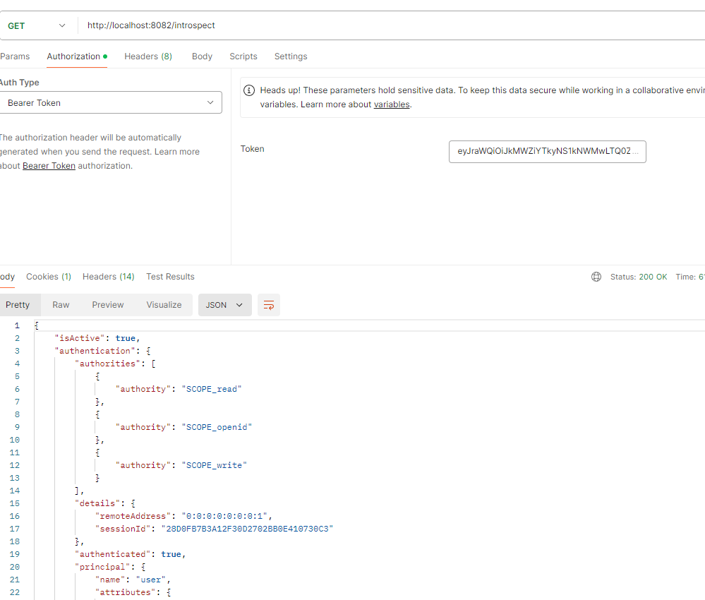

<nav>
    <a href="../.." target="_blank">[Spring Security OAuth2]</a>
</nav>

# 19.8 tokenIntrospectionEndpoint() - 토큰 검증

---

## 1. OAuth2TokenIntrospectionEndpointConfigurer
- OAuth2 토큰 검사 엔드포인트에 대한 사용자 정의 할 수 있는 기능을 제공한다..
- OAuth2 검사 요청에 대한 전처리, 기본 처리 및 후처리 로직을 커스텀하게 구현할 수 있도록 API를 지원한다.
- OAuth2TokenIntrospectionEndpointFilter 를 구성하고, 이를 OAuth2 인증 서버 SecurityFilterChain 의 필터로 등록한다.

### 1.1 init
```java
	@Override
	void init(HttpSecurity httpSecurity) {
		AuthorizationServerSettings authorizationServerSettings = OAuth2ConfigurerUtils.getAuthorizationServerSettings(httpSecurity);
		this.requestMatcher = new AntPathRequestMatcher(
				authorizationServerSettings.getTokenIntrospectionEndpoint(), HttpMethod.POST.name());

		List<AuthenticationProvider> authenticationProviders = createDefaultAuthenticationProviders(httpSecurity);
		if (!this.authenticationProviders.isEmpty()) {
			authenticationProviders.addAll(0, this.authenticationProviders);
		}
		this.authenticationProvidersConsumer.accept(authenticationProviders);
		authenticationProviders.forEach(authenticationProvider ->
				httpSecurity.authenticationProvider(postProcess(authenticationProvider)));
	}
```
- requestMatcher 설정: 기본값은 POST `/oauth2/introspect` 이다.
- AuthenticationProvider 목록 구성
  - 기본: OAuth2TokenIntrospectionAuthenticationProvider
  - 개발자가 커스텀하게 설정한 AuthenticationProvider 이 있다면 이를 제일 최우선 앞단으로 등록함
  - 이들을 httpSecurity 의 authenticationProvider 목록에 일괄 등록한다.


### 1.2 configure
```java
	@Override
	void configure(HttpSecurity httpSecurity) {
		AuthenticationManager authenticationManager = httpSecurity.getSharedObject(AuthenticationManager.class);
		AuthorizationServerSettings authorizationServerSettings = OAuth2ConfigurerUtils.getAuthorizationServerSettings(httpSecurity);

		OAuth2TokenIntrospectionEndpointFilter introspectionEndpointFilter =
				new OAuth2TokenIntrospectionEndpointFilter(
						authenticationManager, authorizationServerSettings.getTokenIntrospectionEndpoint());
		List<AuthenticationConverter> authenticationConverters = createDefaultAuthenticationConverters();
		if (!this.introspectionRequestConverters.isEmpty()) {
			authenticationConverters.addAll(0, this.introspectionRequestConverters);
		}
		this.introspectionRequestConvertersConsumer.accept(authenticationConverters);
		introspectionEndpointFilter.setAuthenticationConverter(
				new DelegatingAuthenticationConverter(authenticationConverters));
		if (this.introspectionResponseHandler != null) {
			introspectionEndpointFilter.setAuthenticationSuccessHandler(this.introspectionResponseHandler);
		}
		if (this.errorResponseHandler != null) {
			introspectionEndpointFilter.setAuthenticationFailureHandler(this.errorResponseHandler);
		}
		httpSecurity.addFilterAfter(postProcess(introspectionEndpointFilter), AuthorizationFilter.class);
	}
```
- AuthenticationConverter 구성
  - OAuth2TokenIntrospectionAuthenticationConverter 기본 등록
  - 개발자가 커스텀으로 등록한 AuthenticationConverter 가 있으면 우선등록
- OAuth2TokenIntrospectionEndpointFilter 구성
  - AuthenticationManager
  - AuthenticationConverter
  - IntrospectionResponseHandler: 성공 처리
  - ErrorResponseHandler: 실패 처리
- 이 필터는 AuthorizationFilter 뒤에서 놓여진다.
  - 클라이언트 인증이 필요하다.

---

## 2. OAuth2TokenIntrospectionEndpointFilter
- OAuth2 토큰 검사 요청을 처리하는 필터이다.
- RequestMatcher: `/oauth2/introspect`, POST
- 구성
  - IntrospectionRequestConverter
    - OAuth2 검사 요청을 추출하려고 할 때 사용되는 전처리기로서 OAuth2TokenIntrospectionAuthenticationToken 을 반환한다
  - OAuth2TokenIntrospectionAuthenticationProvider
    - OAuth2TokenIntrospectionAuthenticationToken 를 받아 인증 처리를 하는 AuthenticationProvider 구현체이다

### 2.1 필터 흐름


```java
	@Override
	protected void doFilterInternal(HttpServletRequest request, HttpServletResponse response, FilterChain filterChain)
			throws ServletException, IOException {

		if (!this.tokenIntrospectionEndpointMatcher.matches(request)) {
			filterChain.doFilter(request, response);
			return;
		}

		try {
			Authentication tokenIntrospectionAuthentication = this.authenticationConverter.convert(request);
			Authentication tokenIntrospectionAuthenticationResult =
					this.authenticationManager.authenticate(tokenIntrospectionAuthentication);
			this.authenticationSuccessHandler.onAuthenticationSuccess(request, response, tokenIntrospectionAuthenticationResult);
		} catch (OAuth2AuthenticationException ex) {
			SecurityContextHolder.clearContext();
			if (this.logger.isTraceEnabled()) {
				this.logger.trace(LogMessage.format("Token introspection request failed: %s", ex.getError()), ex);
			}
			this.authenticationFailureHandler.onAuthenticationFailure(request, response, ex);
		}
	}
```
- authenticationConverter 를 통해 토큰 검증 요청을 미인증 객체로 변환한다.
- authenticationManager 를 통해 실질적 토큰 검증을 수행한다.
- 성공
  - authenticationSuccessHandler 성공 후속 처리
- 실패
  - SecurityContext 에서 인증 클라이언트 정보 말소
  - authenticationFailureHandler 호출 -> 실패 처리

### 2.2 OAuth2TokenIntrospectionAuthenticationConverter
- SecurityContextHolder 를 통해 인증된 클라이언트 정보 추출(clientPrincipal)
- 요청 파라미터에서 token 추출(필수, 없으면 예외 발생)
- 부가적인 정보들이 있다면 이 정보들도 추출
- OAuth2TokenIntrospectionAuthenticationToken 구성

### 2.3 OAuth2TokenIntrospectionAuthenticationProvider
```java
	@Override
	public Authentication authenticate(Authentication authentication) throws AuthenticationException {
		OAuth2TokenIntrospectionAuthenticationToken tokenIntrospectionAuthentication =
				(OAuth2TokenIntrospectionAuthenticationToken) authentication;

		OAuth2ClientAuthenticationToken clientPrincipal =
				getAuthenticatedClientElseThrowInvalidClient(tokenIntrospectionAuthentication);

		OAuth2Authorization authorization = this.authorizationService.findByToken(
				tokenIntrospectionAuthentication.getToken(), null);
		if (authorization == null) {
			if (this.logger.isTraceEnabled()) {
				this.logger.trace("Did not authenticate token introspection request since token was not found");
			}
			// Return the authentication request when token not found
			return tokenIntrospectionAuthentication;
		}

		if (this.logger.isTraceEnabled()) {
			this.logger.trace("Retrieved authorization with token");
		}

		OAuth2Authorization.Token<OAuth2Token> authorizedToken =
				authorization.getToken(tokenIntrospectionAuthentication.getToken());
		if (!authorizedToken.isActive()) {
			if (this.logger.isTraceEnabled()) {
				this.logger.trace("Did not introspect token since not active");
			}
			return new OAuth2TokenIntrospectionAuthenticationToken(tokenIntrospectionAuthentication.getToken(),
					clientPrincipal, OAuth2TokenIntrospection.builder().build());
		}

		RegisteredClient authorizedClient = this.registeredClientRepository.findById(authorization.getRegisteredClientId());
		OAuth2TokenIntrospection tokenClaims = withActiveTokenClaims(authorizedToken, authorizedClient);

		if (this.logger.isTraceEnabled()) {
			this.logger.trace("Authenticated token introspection request");
		}

		return new OAuth2TokenIntrospectionAuthenticationToken(authorizedToken.getToken().getTokenValue(),
				clientPrincipal, tokenClaims);
	}
```
- 현재 Authentication 에서 인증된 클라이언트 정보를 가져온다.
- OAuth2AuthorizationService 에 token 을 전달하여 OAuth2Authorization 을 가져온다. (최종 사용자)
  - 가져오지 못 했다면 token에 대응되는 사용자 인증이 없다는 것이므로 예외 발생
- 조회한 OAuth2Authorization 으로부터 인증 토큰 정보를 가져오고 이 값이 isActive 한지 다음 정보를 기반으로 확인한다.
    - invalidated(무효화됐는가)
    - expired(만료됐는가)
    - isBeforeUse(nbf에서 지정한 시간보다 이전인가: 이 시간 이전에는 처리되어선 안 됨)
    - 이들 중 하나라도 해당되면 isActive 가 아니다. 이럴 경우 비활성화된 토큰이라는 정보가 담긴 OAuth2TokenIntrospectionAuthenticationToken 객체 반환
- OAuth2 클라이언트 정보를 리포지토리에서 조회하고, 토큰의 클레임 정보를 모아서 OAuth2TokenIntrospection 을 구성한다.
- 이 정보를 담아서, OAuth2TokenIntrospectionAuthenticationToken 을 반환한다.

---

## 3. API
- introspectionRequestConverter
- authenticationProvider
- introspectionResponseHandler
- errorResponseHandler

---
 
## 4. 실습

### 4.1 리소스 서버 설정
```yaml
spring.application.name: oauth2-resource-server
server:
  port: 8082
spring:
  security:
    oauth2:
      resourceserver:
        opaquetoken:
          introspection-uri: http://localhost:9000/oauth2/introspect
          client-id: oauth2-client-app1
          client-secret: secret1
```
```kotlin
dependencies {
    implementation("com.nimbusds:oauth2-oidc-sdk:11.13")
}
```
```kotlin
@Configuration
class OAuth2ResourceServerConfig {

    @Bean
    fun securityFilterChain(http: HttpSecurity): SecurityFilterChain {
        http {
            authorizeHttpRequests {
                authorize(anyRequest, authenticated)
            }
            oauth2ResourceServer {
                opaqueToken {  }
            }
        }
        return http.build()
    }

    @Bean
    fun opaqueTokenIntrospector(properties: OAuth2ResourceServerProperties): OpaqueTokenIntrospector {
        val opaqueToken = properties.opaquetoken!!
        return NimbusOpaqueTokenIntrospector(opaqueToken.introspectionUri, opaqueToken.clientId!!, opaqueToken.clientSecret!!)
    }

}
```
- OAuth2ResourceServerConfig 에서 OAuth2ResourceServer 설정을 활성화하고, opaqueToken API를 활성화한다.
- OpaqueTokenIntrospector 빈을 커스텀하게 등록한다.
- 모든 엔드포인트에 대해 opaqueToken 인증이 필요하다.

### 4.2 컨트롤러
```java
    @GetMapping("/introspect")
    fun introspectToken(authentication: BearerTokenAuthentication, @AuthenticationPrincipal principal: OAuth2AuthenticatedPrincipal): OpaqueDto {
        val tokenAttributes = authentication.tokenAttributes as Map<String, *>
        val active = tokenAttributes["active"] as Boolean

        return OpaqueDto(active, authentication, principal)
    }
```
- `/introspect` 에 접근하면 인가서버의 Opaque 인증을 거치고 인증을 하게 된다.
- 이 정보를 담아서 OpaqueDto 형태로 json 응답을 하도록 했다.

### 4.3 실습
- 인가서버에 인증을 수행하고 token 을 발급받는다.
- token 을 받아서, 리소스 서버에 token 을 전달하여 "/introspect" 로 접근한다.

### 4.4 응답


- 인가서버와 통신하여 introspect를 잘 수행하고 응답을 잘 받는 것을 확인할 수 있다.

---
