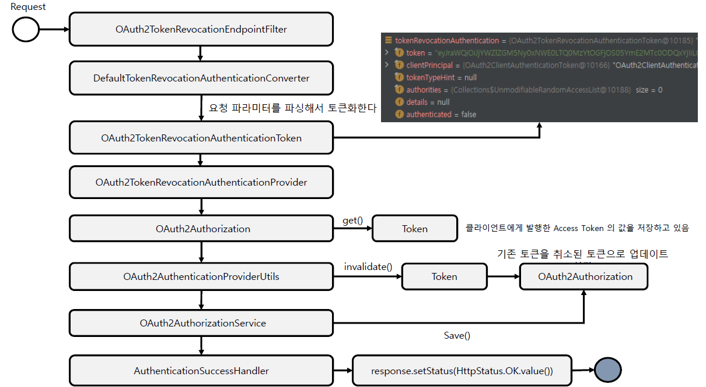
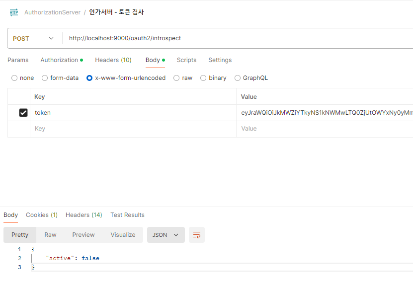

<nav>
    <a href="../.." target="_blank">[Spring Security OAuth2]</a>
</nav>

# 19.9 tokenRevocationEndpoint() - 토큰 취소

---

## 1. OAuth2TokenRevocationEndpointConfigurer
- OAuth2 토큰 취소 엔드포인트에 대한 사용자 정의 할 수 있는 기능을 제공한다.
- OAuth2 토큰 취소에 대한 전처리, 기본 처리 및 후처리 로직을 커스텀하게 구현할 수 있도록 API를 지원한다
- OAuth2TokenRevocationEndpointFilter 를 구성하고 이를 OAuth2 인증 서버 SecurityFilterChain 빈에 등록한다
- init, configure 를 통해 OAuth2TokenRevocationEndpointFilter 를 초기화
- tokenRevocationEndpoint() API
  - revocationRequestConverter
  - authenticationProvider
  - revocationResponseHandler
  - errorResponseHandler

---

## 2. OAuth2TokenRevocationEndpointFilter
- OAuth2 토큰 취소를 처리하는 필터
- RequestMatcher: POST /oauth2/revoke
- 구성
  - DefaultTokenRevocationAuthenticationConverter
    - OAuth2 토큰 취소를 추출하려고 할 때 사용되는 전처리기로서 OAuth2TokenRevocationAuthenticationToken 을 반환한다
  - OAuth2TokenRevocationAuthenticationProvider
    - OAuth2TokenRevocationAuthenticationToken 을 전달받아 인증처리를 하는 AuthenticationProvider 구현체이다.

### 2.1 흐름


```java
	@Override
	protected void doFilterInternal(HttpServletRequest request, HttpServletResponse response, FilterChain filterChain)
			throws ServletException, IOException {

		if (!this.tokenRevocationEndpointMatcher.matches(request)) {
			filterChain.doFilter(request, response);
			return;
		}

		try {
			Authentication tokenRevocationAuthentication = this.authenticationConverter.convert(request);
			Authentication tokenRevocationAuthenticationResult =
					this.authenticationManager.authenticate(tokenRevocationAuthentication);
			this.authenticationSuccessHandler.onAuthenticationSuccess(request, response, tokenRevocationAuthenticationResult);
		} catch (OAuth2AuthenticationException ex) {
			SecurityContextHolder.clearContext();
			if (this.logger.isTraceEnabled()) {
				this.logger.trace(LogMessage.format("Token revocation request failed: %s", ex.getError()), ex);
			}
			this.authenticationFailureHandler.onAuthenticationFailure(request, response, ex);
		}
	}
```
- AuthenticationConverter 을 통해 요청 전처리를 하여 OAuth2TokenRevocationAuthenticationToken 얻기
- authenticationManager 를 통해 인증 처리
- 성공응답: 200 OK
- 실패응답

### 2.2 OAuth2TokenRevocationAuthenticationConverter
```java
	@Override
	public Authentication convert(HttpServletRequest request) {
		Authentication clientPrincipal = SecurityContextHolder.getContext().getAuthentication();

		MultiValueMap<String, String> parameters = OAuth2EndpointUtils.getFormParameters(request);

		// token (REQUIRED)
		String token = parameters.getFirst(OAuth2ParameterNames.TOKEN);
		if (!StringUtils.hasText(token) ||
				parameters.get(OAuth2ParameterNames.TOKEN).size() != 1) {
			throwError(OAuth2ErrorCodes.INVALID_REQUEST, OAuth2ParameterNames.TOKEN);
		}

		// token_type_hint (OPTIONAL)
		String tokenTypeHint = parameters.getFirst(OAuth2ParameterNames.TOKEN_TYPE_HINT);
		if (StringUtils.hasText(tokenTypeHint) &&
				parameters.get(OAuth2ParameterNames.TOKEN_TYPE_HINT).size() != 1) {
			throwError(OAuth2ErrorCodes.INVALID_REQUEST, OAuth2ParameterNames.TOKEN_TYPE_HINT);
		}

		return new OAuth2TokenRevocationAuthenticationToken(token, clientPrincipal, tokenTypeHint);
	}
```
- clientPrincipal: 인증 클라이언트
- token 추출 : 없으면 예외 발생
- OAuth2TokenRevocationAuthenticationToken 반환

### 2.3 OAuth2TokenRevocationAuthenticationProvider : 토큰 취소 실질 처리
```java
	@Override
	public Authentication authenticate(Authentication authentication) throws AuthenticationException {
		OAuth2TokenRevocationAuthenticationToken tokenRevocationAuthentication =
				(OAuth2TokenRevocationAuthenticationToken) authentication;

		OAuth2ClientAuthenticationToken clientPrincipal =
				getAuthenticatedClientElseThrowInvalidClient(tokenRevocationAuthentication);
		RegisteredClient registeredClient = clientPrincipal.getRegisteredClient();

		OAuth2Authorization authorization = this.authorizationService.findByToken(
				tokenRevocationAuthentication.getToken(), null);
		if (authorization == null) {
			if (this.logger.isTraceEnabled()) {
				this.logger.trace("Did not authenticate token revocation request since token was not found");
			}
			// Return the authentication request when token not found
			return tokenRevocationAuthentication;
		}

		if (!registeredClient.getId().equals(authorization.getRegisteredClientId())) {
			throw new OAuth2AuthenticationException(OAuth2ErrorCodes.INVALID_CLIENT);
		}

		OAuth2Authorization.Token<OAuth2Token> token = authorization.getToken(tokenRevocationAuthentication.getToken());
		authorization = OAuth2AuthenticationProviderUtils.invalidate(authorization, token.getToken());
		this.authorizationService.save(authorization);

		if (this.logger.isTraceEnabled()) {
			this.logger.trace("Saved authorization with revoked token");
			// This log is kept separate for consistency with other providers
			this.logger.trace("Authenticated token revocation request");
		}

		return new OAuth2TokenRevocationAuthenticationToken(token.getToken(), clientPrincipal);
	}
```
- OAuth2AuthorizationService 를 통해 OAuth2Authorization 을 가져옴
  - 일치하는 OAuth2Authorization 이 없으면 요청 Authentication 을 그대로 반환(미인증)
- 클라이언트 id 일치여부 확인
- 인증 토큰 무료화 후 OAuth2AuthorizationService 에 반영
- OAuth2TokenRevocationAuthenticationToken 반환

---

## 3. 실습


- token 발급 후, introspect 엔드포인트에 요청하여 토큰 유효성 검사
- token revoke 시키고 introspect 엔드포인트에 요청하여 토큰 유효성 검사

---
