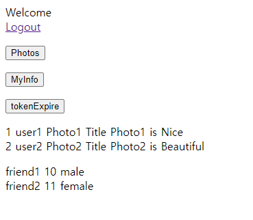

<nav>
    <a href="../.." target="_blank">[Spring Security OAuth2]</a>
</nav>

# 20.1 연동 구현

---

## 1. 요구 사항


### 1.1 연동 구성
- 클라이언트(OAuth2 Client Server)
- 인가 서버(OAuth2 Authorization Server)
- 리소스 서버
  - 앨범 서버(oauth2-resource-server-album)
  - 프렌드 서버(oauth2-resource-server-friend)

### 1.2 처리 순서
- 클라이언트에서 인가서버로 Authorization Code Grant 타입으로 Access Token 을 발급받고
사용자 엔드포인트 요청을 통해 사용자 정보를 가져와서 인증을 진행한다.
- 클라이언트에서 인증에 성공하면 Album 리소스 서버로 자원 요청을 한다 
- Album 리소스 서버에서 Friend 리소스 서버로 토큰을 가지고 내부 통신을 통해 자원 요청을 한다.
- 최종적으로 반환받은 Albums 와 Friends 리소스를 클라이언트로 응답한다

---

## 2. 인가서버 설정
```kotlin
    /**
     * OAuth2 클라이언트 정보 저장 및 관리
     */
    @Bean
    fun registeredClientRepository(): RegisteredClientRepository {
        val registeredClient1 = createRegisteredClient("oauth2-client-app1", "{noop}secret1", "read", "write", "photo", "friend")
        val registeredClient2 = createRegisteredClient("oauth2-client-app2", "{noop}secret2", "read", "delete")
        val registeredClient3 = createRegisteredClient("oauth2-client-app3", "{noop}secret3", "read", "update")

        return InMemoryRegisteredClientRepository(registeredClient1, registeredClient2, registeredClient3)
    }
```
```kotlin
            .redirectUri("http://127.0.0.1:8081")
            .redirectUri("http://127.0.0.1:8081/login/oauth2/code/springoauth2")
            .scope(OidcScopes.OPENID)
            .scope(OidcScopes.PROFILE)
            .scope(OidcScopes.EMAIL)
            .tokenSettings(TokenSettings.builder().accessTokenTimeToLive(Duration.ofSeconds(1L)).build()) // 리프레시 토큰 요청 시 리프레시 토큰도 재갱신
            .clientSettings(ClientSettings.builder().requireAuthorizationConsent(true).build())
```
- 클라이언트 등록
  - clientId: oauth2-client-app1
  - clientSecret: secret1
  - redirectUri: `http://127.0.0.1:8081/login/oauth2/code/springoauth2`
  - scopes: openid, profile, email, read, write, photo, friend
  - 토큰 설정: 액세스토큰을 발급 후 1초만에 만료 시킴
  - 클라이언트 인증: post, basic
- OAuth2AuthorizatonServer 설정 등록

---

## 3. 앨범 서버

### 3.1 application.yml
```yaml
server:
  port: 8082

spring:
  security:
    oauth2:
      resourceserver:
        jwt:
          jwk-set-uri: http://localhost:9000/oauth2/jwks
```
- 포트: 8082
- jwk-set-uri: 인가서버의 jwk-set-uri 를 지정
- 따라서 JwtDecoder 구성시 jwk-set 정보가 필요하므로 앨범서버 구동시 인가서버가 먼저 구동되어야 한다.

### 3.2 보안 설정
```kotlin
@Configuration
class AlbumServerSecurityConfig {

    @Bean
    fun securityFilterChain(http: HttpSecurity): SecurityFilterChain {
        http {
            authorizeHttpRequests {
                authorize("/photos", hasAuthority("SCOPE_photo"))
                authorize("/myInfo", hasAuthority("SCOPE_photo"))
                authorize(anyRequest, authenticated)
            }
            cors {
                configurationSource = corsConfigurationSource()
            }
            oauth2ResourceServer {
                jwt {  }
            }
        }
        return http.build()
    }

    private fun corsConfigurationSource(): CorsConfigurationSource {
        val corsConfiguration = CorsConfiguration()
        corsConfiguration.addAllowedOrigin("http://127.0.0.1:8081")
        corsConfiguration.addAllowedMethod("*")
        corsConfiguration.addAllowedHeader("*")
        corsConfiguration.allowCredentials = true
        corsConfiguration.maxAge = 3600L

        val source = UrlBasedCorsConfigurationSource()
        source.registerCorsConfiguration("/**", corsConfiguration)
        return source
    }
}
```
- `OAuth2ResourceServer`
  - jwt 인증 활성화
  - "/photos", "/myInfo" 접근 - "SCOPE_photo" 필요(scope에 "photo"가 반드시 필요하다)
  - cors 설정 : `http://127.0.0.1:8081` 출처에 대해 cors 허용

### 3.3 앨범서버 - `/photos`
```kotlin
@RestController
class AlbumController(
    private val photoService: PhotoService
) {

    @GetMapping("/photos")
    fun photos(): List<Photo> {
        return photoService.loadPhotos()
    }
}
```
```kotlin
@Service
class PhotoService(
    private val photoLoader: PhotoLoader,
) {

    fun loadPhotos(): List<Photo> {
        return photoLoader.loadPhotos()
    }
}
```
```kotlin
@Component
class PhotoLoader {

    fun loadPhotos(): List<Photo> {
        val photo1 = Photo(
            photoId = "1",
            photoTitle = "Photo1 Title",
            photoDescription = "Photo1 is Nice",
            userId = "user1"
        )
        val photo2 = Photo(
            photoId = "2",
            photoTitle = "Photo2 Title",
            photoDescription = "Photo2 is Beautiful",
            userId = "user2"
        )
        return listOf(photo1, photo2)
    }
}
```
- 간단하게 2개의 photo 를 리스트로 반환하도록 했다

### 3.4 앨범서버 - `/myInfo`
```kotlin
@Component
class MyInfoLoader(
    private val friendClient: FriendClient,
    private val photoLoader: PhotoLoader,
) {

    fun loadMyInfo(): MyInfo {
        val photos = photoLoader.loadPhotos()
        val friends = friendClient.loadFriends()
        return MyInfo(photos, friends)
    }
}
```
```kotlin
@Component
class FriendClient(
    private val restOperations: RestOperations,
) {

    fun loadFriends(): List<Friend> {
        val header = HttpHeaders()
        val authentication =
            SecurityContextHolder.getContextHolderStrategy().context.authentication as JwtAuthenticationToken
        header.add("Authorization", "Bearer ${authentication.token.tokenValue}")

        val url = "http://127.0.0.1:8083/friends"
        val entity = HttpEntity<Any>(header)
        val response: ResponseEntity<List<Friend>> = restOperations.exchange(url, HttpMethod.GET, entity,
            object : ParameterizedTypeReference<List<Friend>>() {})

        return response.body!!
    }
}
```
- photo 리스트, friend 리스트를 MyInfo 로 묶어서 응답으로 내려줌
- 이때 friend 리스트는 friend 서버를 통해 요청해서 얻어와 내려준다.
  - 액세스토큰을 지참해야한다.

### 3.5 토큰 만료 API? - `/tokenExpire`
```kotlin
@RestController
class TokenController {

    @GetMapping("/tokenExpire")
    fun tokenExpire(): Map<String, Any> {
        val result: MutableMap<String, Any> = HashMap()
        result["error"] = OAuth2Error("invalid token", "token is expired", null)

        return result
    }
}
```
- 단순하게 외부에서 '/tokenExpire'를 호출했을 때 예외 응답을 만들어서 내려주도록 했다.

---

## 4. friend 서버

### 4.1 application.yml
```yaml
server:
  port: 8083

spring:
  security:
    oauth2:
      resourceserver:
        jwt:
          jwk-set-uri: http://localhost:9000/oauth2/jwks
```
- 8083 포트
- jwk 설정
- 주의점: 인가서버를 먼저 구동해야한다.

### 4.2 보안설정
```kotlin
@Configuration
class FriendServerSecurityConfig {

    @Bean
    fun securityFilterChain(http: HttpSecurity): SecurityFilterChain {
        http {
            authorizeHttpRequests {
                authorize("/friends", hasAuthority("SCOPE_friend"))
                authorize(anyRequest, authenticated)
            }
            oauth2ResourceServer {
                jwt {  }
            }
        }
        return http.build()
    }

}
```
- 모든 엔드포인트에 jwt 토큰 인증 필요
- "/friends" 엔드포인트 접근 시, "SCOPE_friend" 권한이 필요
  - scope에 "friend"가 있어야한다.


### 4.3 앨범서버 - `/friends`
```kotlin

@RestController
class FriendController {

    @GetMapping("/friends")
    fun friends(): List<Friend> {
        val friend1 = Friend("friend1", 10, "male")
        val friend2 = Friend("friend2", 11, "female")

        return listOf(friend1, friend2)
    }
}
```
- 단순하게 친구 목록을 반환하는 역할만 한다.

---

## 4. 클라이언트

### 4.1 application.yaml
```yaml
spring.application.name: oauth2-client
server:
  port: 8081

spring:
  security:
    oauth2:
      client:
        registration:
          springoauth2:
            client-id: oauth2-client-app1
            client-secret: secret1
            scope: openid,read,write,photo,friend
            authorization-grant-type: authorization_code
            redirect-uri: http://127.0.0.1:8081/login/oauth2/code/springoauth2
        provider:
          springoauth2:
            issuer-uri: http://localhost:9000
```
- 8081 포트
- client 설정
  - registration
    - client-id, client-secret 설정 필수
    - authorization_code 인증을 사용할 경우 redirect-uri 필수
    - scope 지정
  - provider 설정 : issuer-uri 설정을 해주기만 하면 된다

### 4.2 보안설정
```kotlin
@EnableWebSecurity
@Configuration
class OAuth2ClientConfig(
    private val clientRegistrationRepository: ClientRegistrationRepository,
    private val authorizedClientRepository: OAuth2AuthorizedClientRepository
) {

    @Bean
    fun securityFilterChain(http: HttpSecurity): SecurityFilterChain {
        http {
            authorizeHttpRequests {
                authorize("/", permitAll)
                authorize("/home", permitAll)
                authorize(anyRequest, authenticated)
            }
            oauth2Login {
                // oauth2 로그인 성공 후 리다이렉트 페이지
                defaultSuccessUrl("/", true)
            }
        }
        return http.build()
    }

    @Bean
    fun oauth2AuthorizedClientManager(): OAuth2AuthorizedClientManager {
        val provider = OAuth2AuthorizedClientProviderBuilder.builder()
            .authorizationCode()
            .refreshToken()
            .build()

        val manager = DefaultOAuth2AuthorizedClientManager(clientRegistrationRepository, authorizedClientRepository)
        manager.setAuthorizedClientProvider(provider)
        return manager
    }

}
```
- `/`, `/home` 접근 시 누구나 접근 허용
- 그 외 모든 엔드포인트는 인증 필요
- oauth2 Login 기능 활성화(스프링 시큐리티 자동구성 활용)
  - 인증 성공 시 "/" 페이지로 리다이렉트

### 4.3 ApiController
```kotlin
@RestController
class ApiController(
    private val restOperations: RestOperations,
    private val oAuth2AuthorizedClientService: OAuth2AuthorizedClientService,
    private val oAuth2AuthorizedClientManager: OAuth2AuthorizedClientManager,
){

    @GetMapping("/token")
    fun token(@RegisteredOAuth2AuthorizedClient("springoauth2") client: OAuth2AuthorizedClient): OAuth2AccessToken {
        return client.accessToken
    }

    @GetMapping("/tokenExpire")
    fun expireToken(authentication: OAuth2AuthenticationToken): Map<String, Any> {
        val client = oAuth2AuthorizedClientService.loadAuthorizedClient<OAuth2AuthorizedClient>(authentication.authorizedClientRegistrationId, authentication.name)

        val header = HttpHeaders()

        header.add("Authorization", "Bearer " + client.accessToken.tokenValue)
        val entity: HttpEntity<*> = HttpEntity<Any>(header)
        val url = "http://localhost:8082/tokenExpire"
        val response = restOperations.exchange(
            url,
            HttpMethod.GET,
            entity,
            object : ParameterizedTypeReference<Map<String, Any>>() {})

        println("토큰 만료!")
        return response.body!!
    }

    @GetMapping("/newAccessToken")
    fun newAccessToken(authentication: OAuth2AuthenticationToken, request: HttpServletRequest, response: HttpServletResponse): OAuth2AccessToken {
        var client = oAuth2AuthorizedClientService.loadAuthorizedClient<OAuth2AuthorizedClient>(authentication.authorizedClientRegistrationId, authentication.name)

        if (client != null && client.refreshToken != null) {
            println("토큰 재발급 시작")
            val clientRegistration = ClientRegistration
                .withClientRegistration(client.clientRegistration)
                .authorizationGrantType(AuthorizationGrantType.REFRESH_TOKEN)
                .build()

            oAuth2AuthorizedClientService.removeAuthorizedClient(authentication.authorizedClientRegistrationId, authentication.name)

            client = OAuth2AuthorizedClient(clientRegistration, authentication.name, client.accessToken, client.refreshToken)

            val oAuth2AuthorizeRequest =
                OAuth2AuthorizeRequest.withAuthorizedClient(client)
                    .principal(authentication)
                    .attribute(HttpServletRequest::class.java.name, request)
                    .attribute(HttpServletResponse::class.java.name, response)
                    .build()
            client = oAuth2AuthorizedClientManager.authorize(oAuth2AuthorizeRequest)
            oAuth2AuthorizedClientService.saveAuthorizedClient(client, authentication)
        }
        return client.accessToken
    }

}
```
- `/token` : 현재 인증된 사용자의 OAuth2AuthorizedClient 를 가져와서(OAuth2AuthorizedClientArgumentResolver) accessToken 반환
- `/tokenExpire` : 토큰 만료시키기
  - 실제로 토큰을 만료시키는건 아니고, 가짜로 구성
  - 여기서는 앨범서버의 `/tokenExpire` 엔드포인트에 요청해서 가짜 응답을 받아 그대로 반환한다.
- `/newAccessToken`: 인가서버에 요청해서 실제로 accessToken 을 다시 발급받은 뒤 반환하기
  - oAuth2AuthorizedClientService 를 통해 OAuth2AuthorizedClient 를 가져오고 새로 인증 요청을 구성한다
  - oAuth2AuthorizedClientManager 에 요청하여 액세스 토큰을 재발급

---

## 5. 실습

### 5.1 구동
- 인가서버를 먼저 구동해야한다.
  - jwk-set 이 초기화된다.
  - 메타데이터 엔드포인트가 구성된다.
- 클라이언트, 앨범서버, friend 서버 구동
  - 클라이언트 : ClientRegistration 설정 시 인가서버의 메타데이터를 참고한다.
  - 앨범서버, friend 서버 : JwtDecoder 구성시 jwk-set-uri 를 참고한다.

### 5.2 클라이언트 소셜 로그인 페이지 접속
- 클라이언트 `http://127.0.0.1:8081` 로 접속
  - localhost 로 할 수는 있으나 인가서버에 redirect_uri 를 127.0.0.1 로 등록했기 때문에 이후 인증 후 리다이렉트가 127.0.0.1 로 된다.
  - 이렇게 되면 클라이언트 측에는 127.0.0.1 에 대한 세션으로 인증정보가 저장되고 localhost 에 대한 세션정보가 저장되지 않기 때문에 문제가 발생한다
- 인증되지 않았으므로 페이지에 로그인 버튼이 노출된다
- 로그인 버튼의 링크
  - GET, `http://127.0.0.1:8081/oauth2/authorization/springoauth2`
- 클라이언트의 OAuth2AuthorizationRequestRedirectFilter 에서 요청을 가로챈다.
  - DefaultOAuth2AuthorizationRequestResolver 작동
    - url 의 clientId 를 추출
    - 이 값을 통해 clientRegistrationRepository 에서 ClientRegistration 찾기
    - 참고로 여기서 ClientAuthenticationMethod 가 none 일 때만 PKCE를 적용하는데 이를 바꾸고 싶다면 커스텀한 OAuth2AuthorizationRequestResolver 를 구성해야한다
    - scope에 openid 가 있으면 nonce 도 생성한다.
    - redirect_uri 등 여러가지 정보를 취합하여 OAuth2AuthorizationRequest 를 구성한다.
  - sendRedirectForAuthorization
    - OAuth2AuthorizationRequestRepository 에 OAuth2AuthorizationRequest 저장
    - 인가서버의 코드 발급 엔드포인트로 리다이렉트한다

### 5.3 인가서버 코드 발급
- 인가 서버의 코드 발급 엔드포인트로 요청한다.
  - GET `/oauth2/authorize`
- 인증되지 않았으므로 "/login" 로 리다이렉트된다.
  - 이때 요청 정보는 캐싱되어 이후 성공 이후 재사용된다
- 인가서버에 로그인을 해야한다.
  - 로그인 후, 캐싱된 요청으로 다시 리다이렉트된다.
- 인가서버의 코드 발급 엔드포인트 작동: OAuth2AuthorizationEndpointFilter
  - authenticationConverter(OAuth2AuthorizationCodeRequestAuthenticationConverter): 요청 전처리
  - authenticationManager(ProviderManager) - OAuth2AuthorizationCodeRequestAuthenticationProvider
    - 동의여부 확인
    - 동의가 필요하므로 OAuth2AuthorizationService 에 OAuth2ClientRegistration 저장 후 OAuth2AuthorizationConsentAuthenticationToken 반환
- 동의화면 응답: OAuth2AuthorizationEndpointFilter 에서는 동의화면 렌더링 응답을 내림
- 동의
  - 동의화면을 렌더링 받으면 동의를 진행한다.
  - POST `/oauth2/authorize`
  - OAuth2AuthorizationEndpointFilter 에서 다시 요청을 가로챔
  - authenticationConverter(OAuth2AuthorizationConsentAuthenticationConverter) 전처리
  - authenticationProvider(OAuth2AuthorizationConsentAuthenticationProvider) 검증 및 code 발급
    - OAuth2Authorization 재구성 및 저장
    - OAuth2AuthorizationCodeRequestAuthenticationToken 반환됨
  - authenticationSuccessHandler 실행
    - code 및 state 를 redirect_uri 에 담아 응답
- 클라이언트의 redirect_uri 로 리다이렉트 된다. 이 uri 는 클라이언트의 토큰 엔드포인트이다.
  - `http://127.0.0.1:8081/login/oauth2/code/springoauth2`

### 5.4 액세스 토큰 발급
- OAuth2LoginAuthenticationFilter 작동
- AuthorizationManager -> ProviderManager
  - OAuth2LoginAuthenticationProvider -> AuthorizationCodeAuthenticationProvider : 액세스 토큰 발급 후 인증
    - scopes 에 openid 가 있으면 여기서 처리되지 않는다
  - OidcAuthorizationCodeAuthenticationProvider : Oidc Id Token 발급 후 인증
    - OidcUserService 가 작동하여, id_token 기반으로 회원 정보를 구성한다.
  - OAuth2LoginAuthenticationToken 이 구성되고 반환된다.
- 필터에서는 이 토큰을 OAuth2AuthenticationToken 로 변환한다.
- OAuth2AuthorizedClientRepository 에 OAuth2AuthorizedClient 를 생성하여 새로 저장한다.
- 이 인증 정보가 SecurityContextHolderRepository(세션) 에 저장되어, 이후 로그인할 때 해당 인증 정보를 재사용할 수 있다.
- 성공후 "/" 로 리다이렉트 된다.

### 5.5 인가서버 입장 - OAuth2 토큰 발급
- 토큰 발급 엔드포인트 : OAuth2TokenEndpointFilter (`http://localhost:9000/oauth2/token`, POST)
  - 클라이언트 인증이 필요하다. OAuth2ClientAuthenticationFilter 에서 인증을 해야한다.
- OAuth2TokenEndpointFilter
  - OAuth2AuthorizationCodeAuthenticationConverter 전처리
  - OAuth2AuthorizationCodeAuthenticationProvider 실질 인증, 토큰 발급 처리
    - 내부적으로 TokenGenerator 가 사용된다.
    - id_token 도 함께 발행된다.

### 5.6 "/" -> access token 버튼


```javascript
        const token = () => {
            fetch("/token")
                .then(response => response.json())
                .then(data => {
                    console.log("access token = " + data.tokenValue);
                    window.localStorage.setItem("access_token", data.tokenValue);
                    location.href = "/home";
                })
        }
```
```kotlin
    @GetMapping("/token")
    fun token(@RegisteredOAuth2AuthorizedClient("springoauth2") client: OAuth2AuthorizedClient): OAuth2AccessToken {
        return client.accessToken
    }
```
- 클라이언트의 "/token" 엔드포인트는 액세스토큰을 응답으로 내려주게 해놨다.
  - OAuth2AuthorizedClientArgumentResolver 를 통해 OAuth2AuthorizedClient 를 얻어오고 이 액세스토큰이 반환된다. 


- 브라우저에서 access token 버튼을 클릭했을 때 다음 자바스크립트 코드가 실행되게 했다.
  - 응답으로 받은 access_token 을 로컬 스토리지에 "access_token" 키로 저장
  - "/home" 으로 리다이렉트

### 5.7 앨범 서버 "/photos"
```javascript
const photos = () => {
    fetch("http://127.0.0.1:8082/photos", {
        method: "GET",
        headers: {
            Authorization: "Bearer " + localStorage.getItem("access_token")
        }
    })
        .then(res => res.json())
        .then(data => {
            for (const prop in data) {
                document.querySelector("#remotePhotos").append(`${data[prop].userId} `);
                document.querySelector("#remotePhotos").append(`${data[prop].photoId} `);
                document.querySelector("#remotePhotos").append(`${data[prop].photoTitle} `);
                document.querySelector("#remotePhotos").append(`${data[prop].photoDescription} `);
                document.querySelector("#remotePhotos").append(document.createElement('br'));
            }
        })
}
```
- Photos 버튼을 클릭하면 위의 자바스크립트 함수가 실행된다.
- 앨범 서버 `http://127.0.0.1:8082/photos` 로 요청
  - 참고로 앨범서버에서는 `http://127.0.0.1:8081` 출처에 대해서 cors를 허용해야한다.(위에서 설정함)
  - 액세스토큰을 지참해야한다.
  - 응답을 화면에 뿌려주게 함
- BearerTokenAuthenticationFilter 를 통해 jwt 인증이 이루어진다.
  - 내부적으로 jwk-set 을 통해 공개키를 얻어와서, jwt 검증을 수행한다.
  - 토큰이 만료됐거나, 잘못됐거나, ... 등의 여부도 검증된다.
  - 참고로 액세스 토큰 발급 후 1초 뒤에 만료되도록 설정했는데 JwtTimestampValidator 는 기본적으로 1분의 clockSkew 를 두므로 1분정도는 토큰을 유효하다고 판단한다.
  따라서 1분동안은 유효하다고 판단될 것이다. 1분이 지나면 토큰이 유효하지 않다고 판별된다.
- 인가
  - Scope에 "photo" 가 포함되어야한다. 그렇지 않을 경우 인가 실패 예외가 발생한다.


- 위의 과정을 통과해야만 앨범 서버의 "/photos" 에 접근할 수 있고 제대로 응답을 받을 수 있다.

### 5.8 앨범서버 "/myInfo"
```javascript

        const myInfo = () => {
            fetch("http://127.0.0.1:8082/myInfo", {
                method: "GET",
                headers: {
                    Authorization: "Bearer " + localStorage.getItem("access_token")
                }
            })
                .then(res => {
                    if (res.status >= 400) {
                        console.log(`예외 발생 ${res.json()}`)
                        throw Error(res.toString())
                    }
                    return res.json()
                })
                .then(data => {
                    let photos = data["photos"];
                    let friends = data["friends"];
                    for (let i = 0; i < photos.length; i++) {
                        document.querySelector("#albums").append(`${photos[i].photoId} `);
                        document.querySelector("#albums").append(`${photos[i].userId} `);
                        document.querySelector("#albums").append(`${photos[i].photoTitle} `);
                        document.querySelector("#albums").append(`${photos[i].photoDescription} `);
                        document.querySelector("#albums").append(document.createElement('br'));
                    }

                    for (let i = 0; i < friends.length; i++) {
                        document.querySelector("#friends").append(`${friends[i].name} `);
                        document.querySelector("#friends").append(`${friends[i].age} `);
                        document.querySelector("#friends").append(`${friends[i].gender} `);
                        document.querySelector("#friends").append(document.createElement('br'));
                    }
                })
                .catch((error) => console.log("error:", error));
        }
```
- MyInfo 버튼을 클릭하면 위 자바스크립트가 실행된다.
- 앨범 서버의 "/myInfo" 엔드포인트가 실행된다.
  - 액세스토큰 지참 필요
  - 내부적으로 friend 서버의 "/friends" 엔드포인트와 통신하는데 이 때도 액세스 토큰을 지참해야한다.
    - 이때 scope 에 "friend"가 없으면 예외가 발생한다



- 인증에 잘 성공하면 myInfo 응답을 제대로 받을 수 있다.

### 5.9 tokenExpire
```javascript

const getNewAccessTokenAndRedirect = () => {
    fetch("/newAccessToken",
        {
            method: "GET",
            headers: {
                "Content-Type": "application/json",
            },
        })
        .then(res => res.json())
        .then(data => {
            console.log("새로 받은 token = " + data.tokenValue);
            window.localStorage.setItem("access_token", data.tokenValue);
            location.href = "/home";
        })
        .catch((error) => console.log("error:", error));
}

const tokenExpire = () => {
    fetch("/tokenExpire",
        {
            method: "GET",
            headers: {
                "Content-Type": "application/json",
            },
        })
        .then(_ => getNewAccessTokenAndRedirect())
        .catch((error) => console.log("error:", error));
}
```
- tokenExpire 버튼을 클릭하면 tokenExpire 함수가 실행된다.
  - 클라이언트의 "/tokenExpire" 엔드포인트 요청 후 응답 받기
    - 여기서는 내부적으로 앨범서버의 "/tokenExpire" 가 실행될 뿐인데 별다른 일은 안 일어나게 했다.
  - getNewAccessTokenAndRedirect 실행
- getNewAccessTokenAndRedirect
  - 클라이언트의 "/newAccessToken" 엔드포인트 요청 후 응답 받기
    - 내부적으로 refresh_token flow 에 따라 인가서버에 토큰 재갱신 요청을 한다.
  - 새로 발급된 액세스토큰을 로컬 스토리지에 저장하고 다시 "/home" 으로 리다이렉트한다.
- 인가서버의 OAuth2TokenEndpointFilter 가 작동한다.
  - OAuth2RefreshTokenAuthenticationConverter
  - OAuth2RefreshTokenAuthenticationProvider


- 토큰이 재갱신되고 로컬 스토리지의 access_token 값이 바뀐 것을 알 수 있다.

---

## 6. 인증 흐름


- 인증 흐름에 헷갈리는 부분이 많이 있어서 흐름도를 보는게 좋다.
- 코드 발급
  - 클라이언트에서 코드 발급 요청을 시작하는 부분은 OAuth2AuthorizationRedirectFilter 이다.
  - 인가 서버에서 코드를 발급하는 부분은 OAuth2AuthorizationFilter 이다.
- 클라이언트 인증(액세스 토큰 발급)
  - 클라이언트 인증: OAuth2LoginAuthenticationFilter
  - 인가서버 토큰 발급 엔드포인트: OAuth2TokenEndpointFilter(OAuth2ClientAuthenticationFilter 를 통해 클라이언트 인증 필요)
  - 사용자 정보 획득: 필요에 따라 사용자 정보를 얻어와야할 수 있다. 스프링 AuthorizationServer는 openid connect 방식의 사용자 정보 엔드포인트를 제공한다
    - OidcUserInfoEndpointFilter 를 통해 사용자 정보를 얻어와 인증에 사용한다.
  - id_token 검증
    - openid connect 방식의 경우 id_token 검증도 수행하는데 이 경우 JwtDecoder 가 작동한다.
    - 인가서버의 JwkSet 엔드포인트를 통해 공개키를 얻어와야하는데 이 부분은 NimbusJwkSetEndpointFilter 가 작동한다

---

## 7. 리소스 흐름


- 리소스 획득 흐름이다.
- 리소스 서버의 자원 접근에 있어서는 액세스 토큰을 반드시 지참해야한다.

---

