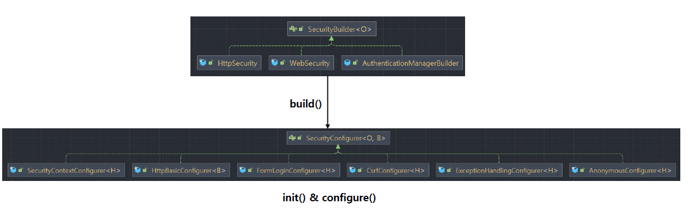
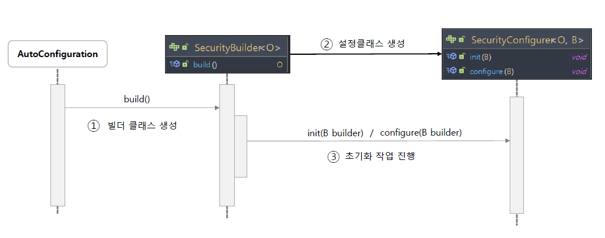
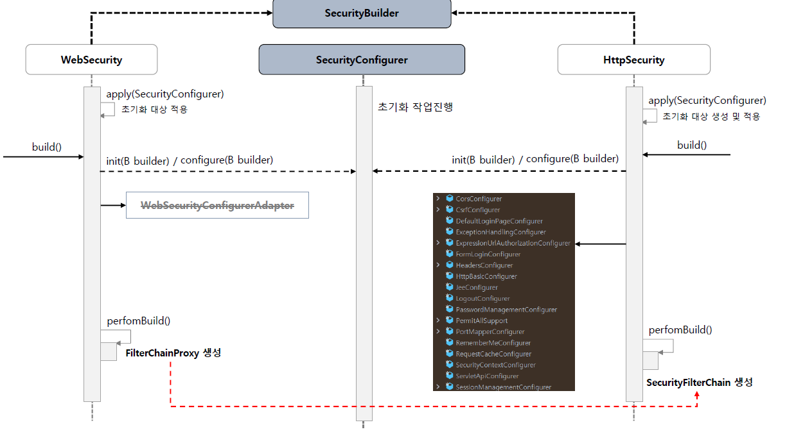

<nav>
    <a href="../../#fundamentals" target="_blank">[Spring Security OAuth2]</a>
</nav>

# 초기화 과정 이해 - SecurityBuilder & SecurityConfigurer

---

## SecurityBuilder
```java
public interface SecurityBuilder<O> {
	O build() throws Exception;
}
```





- `SecurityBuilder` 는 빌더 클래스로서 웹 보안을 구성하는 빈 객체와 설정클래스들을 생성하는 역할을 하며 WebSecurity, HttpSecurity 가 있다.
- `build()` 메서드가 퍼블릭 인터페이스를 제공한다.
- 기본적으로 시큐리티 설정들은 build() 가 호출된 이후 내부적으로 여러 초기화 작업이 이루어지면서, 보안에 필요한 컴포넌트가 생성되어지는 식으로
  이루어진다.




- HttpSecurity : `build()`를 호출하면, SecurityFilterChain 이 생성된다.
  - 이 클래스를 기반으로 SecurityFilterChain을 구성하고 빈으로 등록하는 것이 스프링시큐리티 최신버전에서의 기본 설정법이다.
  - 참고로 우리가 build를 호출하기 전에 apply를 실행하면 추가적인 설정을 더 등록할 수 있다.
- WebSecurity : `build()`를 호출하면 FilterChainProxy가 생성된다.
  - WebSecurity 는 securityFilterChain 목록을 가지고 있는데 WebSecurityConfiguration에서 우리가 앞에서 등록한 SecurityFilterChain 빈들이
  주입되어진다.
  - WebSecurity의 build()가 호출된 뒤 몇 가지 추가 설정을 거친뒤 FilterChainProxy가 만들어진다.

---

## 코드 읽기
```java
// AbstractConfiguredSecurityBuilder

	@Override
	protected final O doBuild() throws Exception {
		synchronized (this.configurers) {
			this.buildState = BuildState.INITIALIZING;
			beforeInit();
			init();
			this.buildState = BuildState.CONFIGURING;
			beforeConfigure();
			configure();
			this.buildState = BuildState.BUILDING;
			O result = performBuild();
			this.buildState = BuildState.BUILT;
			return result;
		}
	}
```
- SecurityBuilder 의 자식 클래스들을 쭉 따라가다 보면 위와 같은 로직을 발견해볼 수 있는데, 여기서 눈여겨 볼 부분은 `init()`, `configure()`, `performBuild()` 이 있다.

```java
private void init() throws Exception {
    Collection<SecurityConfigurer<O, B>> configurers = getConfigurers();
    for (SecurityConfigurer<O, B> configurer : configurers) {
        configurer.init((B) this);
    }
    for (SecurityConfigurer<O, B> configurer : this.configurersAddedInInitializing) {
        configurer.init((B) this);
    }
}
```
```java
private void configure() throws Exception {
    Collection<SecurityConfigurer<O, B>> configurers = getConfigurers();
    for (SecurityConfigurer<O, B> configurer : configurers) {
        configurer.configure((B) this);
    }
}
```
- `SecurityBuilder` 는 내부적으로 우리가 설정한 `SecurityConfigurer` 를 포함하고 있으며 인증 및 인가 초기화 작업은 `SecurityConfigurer` 에 의해 진행된다.
  - `SecurityConfigurer` 는 우리가 설정 클래스에서 수행한 설정을 기반으로 만들어진 설정 객체들이다. (예: 익명 사용자 설정, 세션 설정, ...)
  - 이들은 Http 요청과 관련된 보안처리를 담당하는 필터 및 주요 객체들을 생성하고 여러 초기화 설정에 관여한다.
- init, configure 메서드를 거치면서 각각의 SecurityConfigurer 들에 대해 초기화, 설정 작업이 진행되고 보안에 필요한 필터들이 구성된다.
```java

// HttpSecurity

	protected DefaultSecurityFilterChain performBuild() {
		ExpressionUrlAuthorizationConfigurer<?> expressionConfigurer = getConfigurer(
				ExpressionUrlAuthorizationConfigurer.class);
		AuthorizeHttpRequestsConfigurer<?> httpConfigurer = getConfigurer(AuthorizeHttpRequestsConfigurer.class);
		boolean oneConfigurerPresent = expressionConfigurer == null ^ httpConfigurer == null;
		Assert.state((expressionConfigurer == null && httpConfigurer == null) || oneConfigurerPresent,
				"authorizeHttpRequests cannot be used in conjunction with authorizeRequests. Please select just one.");
		this.filters.sort(OrderComparator.INSTANCE);
		List<Filter> sortedFilters = new ArrayList<>(this.filters.size());
		for (Filter filter : this.filters) {
			sortedFilters.add(((OrderedFilter) filter).filter);
		}
		return new DefaultSecurityFilterChain(this.requestMatcher, sortedFilters);
	}
```
```java
	@Override
protected Filter performBuild() throws Exception {
  Assert.state(!this.securityFilterChainBuilders.isEmpty(),
          () -> "At least one SecurityBuilder<? extends SecurityFilterChain> needs to be specified. "
                  + "Typically this is done by exposing a SecurityFilterChain bean. "
                  + "More advanced users can invoke " + WebSecurity.class.getSimpleName()
                  + ".addSecurityFilterChainBuilder directly");
  int chainSize = this.ignoredRequests.size() + this.securityFilterChainBuilders.size();
  List<SecurityFilterChain> securityFilterChains = new ArrayList<>(chainSize);
  List<RequestMatcherEntry<List<WebInvocationPrivilegeEvaluator>>> requestMatcherPrivilegeEvaluatorsEntries = new ArrayList<>();
  for (RequestMatcher ignoredRequest : this.ignoredRequests) {
    WebSecurity.this.logger.warn("You are asking Spring Security to ignore " + ignoredRequest
            + ". This is not recommended -- please use permitAll via HttpSecurity#authorizeHttpRequests instead.");
    SecurityFilterChain securityFilterChain = new DefaultSecurityFilterChain(ignoredRequest);
    securityFilterChains.add(securityFilterChain);
    requestMatcherPrivilegeEvaluatorsEntries
            .add(getRequestMatcherPrivilegeEvaluatorsEntry(securityFilterChain));
  }
  for (SecurityBuilder<? extends SecurityFilterChain> securityFilterChainBuilder : this.securityFilterChainBuilders) {
    SecurityFilterChain securityFilterChain = securityFilterChainBuilder.build();
    securityFilterChains.add(securityFilterChain);
    requestMatcherPrivilegeEvaluatorsEntries
            .add(getRequestMatcherPrivilegeEvaluatorsEntry(securityFilterChain));
  }
  if (this.privilegeEvaluator == null) {
    this.privilegeEvaluator = new RequestMatcherDelegatingWebInvocationPrivilegeEvaluator(
            requestMatcherPrivilegeEvaluatorsEntries);
  }
  FilterChainProxy filterChainProxy = new FilterChainProxy(securityFilterChains);
  if (this.httpFirewall != null) {
    filterChainProxy.setFirewall(this.httpFirewall);
  }
  if (this.requestRejectedHandler != null) {
    filterChainProxy.setRequestRejectedHandler(this.requestRejectedHandler);
  }
  else if (!this.observationRegistry.isNoop()) {
    CompositeRequestRejectedHandler requestRejectedHandler = new CompositeRequestRejectedHandler(
            new ObservationMarkingRequestRejectedHandler(this.observationRegistry),
            new HttpStatusRequestRejectedHandler());
    filterChainProxy.setRequestRejectedHandler(requestRejectedHandler);
  }
  filterChainProxy.setFilterChainDecorator(getFilterChainDecorator());
  filterChainProxy.afterPropertiesSet();
  
  Filter result = filterChainProxy;
  if (this.debugEnabled) {
    this.logger.warn("\n\n" + "********************************************************************\n"
            + "**********        Security debugging is enabled.       *************\n"
            + "**********    This may include sensitive information.  *************\n"
            + "**********      Do not use in a production system!     *************\n"
            + "********************************************************************\n\n");
    result = new DebugFilter(filterChainProxy);
  }
  
  this.postBuildAction.run();
  return result;
}
```
- HttpSecurity의 경우 `performBuild()`가 호출되면, 필터들을 기반으로 SecurityFilterChain이 구성된다.
- WebSecurity의 경우 자신이 가지고 있는 SecurityFilterChain 들을 기반으로 FilterChainProxy를 구성한다.

---

## HttpSecurity
```java
// HttpSecurityConfiguration

	@Bean(HTTPSECURITY_BEAN_NAME)
	@Scope("prototype")
	HttpSecurity httpSecurity() throws Exception {
		LazyPasswordEncoder passwordEncoder = new LazyPasswordEncoder(this.context);
		AuthenticationManagerBuilder authenticationBuilder = new DefaultPasswordEncoderAuthenticationManagerBuilder(
				this.objectPostProcessor, passwordEncoder);
		authenticationBuilder.parentAuthenticationManager(authenticationManager());
		authenticationBuilder.authenticationEventPublisher(getAuthenticationEventPublisher());
		HttpSecurity http = new HttpSecurity(this.objectPostProcessor, authenticationBuilder, createSharedObjects());
		WebAsyncManagerIntegrationFilter webAsyncManagerIntegrationFilter = new WebAsyncManagerIntegrationFilter();
		webAsyncManagerIntegrationFilter.setSecurityContextHolderStrategy(this.securityContextHolderStrategy);
		// @formatter:off
		http
			.csrf(withDefaults())
			.addFilter(webAsyncManagerIntegrationFilter)
			.exceptionHandling(withDefaults())
			.headers(withDefaults())
			.sessionManagement(withDefaults())
			.securityContext(withDefaults())
			.requestCache(withDefaults())
			.anonymous(withDefaults())
			.servletApi(withDefaults())
			.apply(new DefaultLoginPageConfigurer<>());
		http.logout(withDefaults());
		// @formatter:on
		applyCorsIfAvailable(http);
		applyDefaultConfigurers(http);
		return http;
	}
```
- HttpSecurity는 스프링 시큐리티가 제공하는 프로토타입 빈이다.(의존성 주입을 요청할 때마다, 생성된다.)
- 기본적으로 위와 같이 기본 필터들이 기본값으로 제공되어 진다.

---

## CustomSecurityConfigurer과 DSL
```kotlin
class CustomSecurityConfigurer(
    private var isSecure: Boolean = false,
    private var someConfig: Boolean = false,
): AbstractHttpConfigurer<CustomSecurityConfigurer, HttpSecurity>() {

    override fun init(builder: HttpSecurity) {
        super.init(builder)
        println("init method started...")
    }

    override fun configure(builder: HttpSecurity) {
        super.configure(builder)
        println("configure method started...")

        if (isSecure) {
            println("Https is required")
        } else {
            println("https is optional")
        }
    }

    fun setFlag(isSecure: Boolean): CustomSecurityConfigurer {
        this.isSecure = isSecure
        return this
    }

    fun setSomeConfig(someConfig: Boolean) : CustomSecurityConfigurer {
        this.someConfig = someConfig
        return this
    }
}
```
- 커스텀한 SecurityConfigurer 클래스를 생성할 수 있다.
- init, configurer 를 오버라이드 해둔다면 SecurityBuilder에서 호출하는 과정에서 호출될 수 있다.
- 참고로 아래의 setFlag, setSomeConfig과 같은 메서드를 만들어두면 DSL을 구성할 수 있다. 아래를 참고해보자.

### SecurityConfig
```kotlin
import org.springframework.security.config.annotation.web.invoke

@EnableWebSecurity
@Configuration
class SecurityConfig {

    @Bean
    fun securityFilterChain(http: HttpSecurity): SecurityFilterChain {
        // 여기서 주입된 HttpSecurity는 스프링 시큐리티가 제공하는 프로토타입 빈이다.
        // 이미 기본적인 설정이 어느 정도 되어 있고, 우리가 등록한 추가 설정이 여기에 더해진다.
        http {
            authorizeHttpRequests {
                authorize(anyRequest, authenticated)
            }
            formLogin {  }
            apply(
                // 별도의 커스텀 Configurer를 만들고 나만의 DSL을 구성할 수 있다.
                CustomSecurityConfigurer()
                    .setFlag(false)
                    .setSomeConfig(true)
            )
        }

        // SecurityFilterChain을 구성한다.
        return http.build()
    }
}
```
- apply를 통해, 커스텀한 시큐리티 설정을 등록 가능
  - deprecated 됐던데 지금 이것까지 다 알아보기에는 솔직히 비용이 귀찮고 나중에 정말 필요할 때 반영해도 될듯
- Configurer 를 만들고 빌더패턴 쓰듯이, 객체 자기 자신을 반환하는 메서드 체이닝을 통해 DSL을 구성할 수 있음

---
